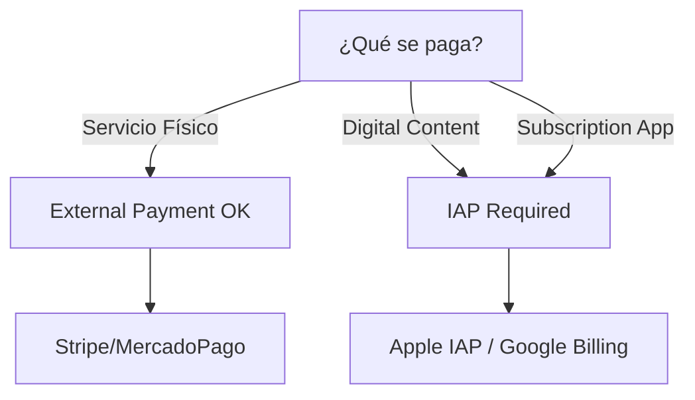

# 2.6.7 App Store Guidelines

> Cumplir con las guías de las tiendas para evitar rechazos y suspensiones.

---

## Checklist Pre-Submit

### iOS App Store

| Requisito | Estado |
|-----------|--------|
| Cuenta de Developer ($99/año) | ✅ |
| App Icon (1024x1024, no transparencia) | ✅ |
| Screenshots (6.7", 6.5", 5.5") | ✅ |
| Privacy Policy URL | ✅ |
| Support URL | ✅ |
| Category: Lifestyle/Services | ✅ |
| Age Rating: 4+ | ✅ |

### Google Play Store

| Requisito | Estado |
|-----------|--------|
| Cuenta de Developer ($25 one-time) | ✅ |
| Feature Graphic (1024x500) | ✅ |
| Screenshots (min 2, max 8) | ✅ |
| Privacy Policy URL | ✅ |
| Target API 34+ | ✅ |
| Category: Auto & Vehicles | ✅ |
| Content Rating: Everyone | ✅ |

---

## Políticas Críticas

### Pagos In-App



**OnlyCar:** ✅ Servicios físicos (lavado de autos) = Pagos externos permitidos

### Permisos Justificados

| Permiso | Justificación (App Store) |
|---------|---------------------------|
| Ubicación | "Para encontrar operadores cercanos y tracking de servicio" |
| Cámara | "Para capturar fotos del vehículo antes/después del servicio" |
| Notificaciones | "Para actualizaciones de estado de tu servicio" |
| Contactos | ❌ NO USAR (no hay justificación) |

---

## Razones Comunes de Rechazo

### iOS

| Razón | Solución |
|-------|----------|
| 4.2 - Minimum Functionality | Asegurar que todas las features funcionen |
| 5.1.1 - Data Collection | Agregar Privacy Nutrition Labels |
| 2.1 - Crashes/Bugs | Test en dispositivos reales |
| 4.0 - Design Guidelines | Seguir HIG (Human Interface Guidelines) |

### Android

| Razón | Solución |
|-------|----------|
| Deceptive Behavior | No exagerar en descripción |
| User Data Policy | Declarar uso de datos en Data Safety |
| Functionality | No tener features "coming soon" |
| Impersonation | Logo y nombre únicos |

---

## ASO (App Store Optimization)

### Keywords Estratégicos

```
Primary: lavado de autos, car wash, limpieza vehicular
Secondary: lavado a domicilio, detailing, autolavado
Long-tail: lavado de autos a domicilio en [ciudad]
```

### Metadata Optimizado

```yaml
# iOS
Title: "OnlyCar - Lavado a Domicilio"  # Max 30 chars
Subtitle: "Solicita lavado de auto donde estés"  # Max 30 chars
Keywords: "lavado,autos,domicilio,carro,limpieza,car,wash"  # Max 100 chars

# Android
Title: "OnlyCar: Lavado de Autos a Domicilio"  # Max 50 chars
Short Description: "Solicita lavado de auto donde sea. Operadores verificados."  # Max 80 chars
```

---

## Test Accounts para Review

```yaml
# Para Apple Review Team
Username: review@onlycar.mx
Password: [VAULT]
Instructions: |
  1. Iniciar sesión con las credenciales
  2. La app mostrará el dashboard de cliente
  3. Para ver el flujo de operador, usar:
     operador-review@onlycar.mx / [VAULT]
```

---

## Relaciones

- Build: [[Proyecto OnlyCarNLD/Datos/2.6.3 Build_Release|Proceso de Release]]
- Updates: [[Proyecto OnlyCarNLD/Datos/2.6.5 Gestion_Updates|OTA Updates]]
- Permisos: [[Proyecto OnlyCarNLD/Datos/2.6.2 Permisos_Nativos|Permisos Nativos]]

---

## Navegación

| ⬆️ Padre             | [[Proyecto OnlyCarNLD/Datos/2.6. Arquitectura_Mobile]]  |
| -------------------- | ----------------------------- |
| ⬅️ Hermano anterior  | [[Proyecto OnlyCarNLD/Datos/2.6.6 Background_Tasks]]    |
| ➡️ Hermano siguiente | [[Proyecto OnlyCarNLD/Datos/2.6.8 Offline_Maps]]        |

---
