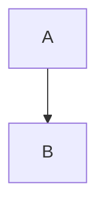

# 2.7.5 Documentation Standards

> La documentación no es un extra, es parte del entregable de código.

---

## Filosofía: Docs-as-Code

1. **Versionada:** Vive en el repo git junto al código.
2. **Estructurada:** Frontmatter YAML obligatorio para parseo algorítmico.
3. **Viva:** Se actualiza en el mismo PR que cambia la funcionalidad.

---

## Estructura de Archivo (.md)

Toda hoja de documentación debe seguir este esqueleto:

```markdown
---
id: X.Y.Z
title: Nombre Claro
parent: 'X.Y'
breadcrumb: 0 → X → X.Y → X.Y.Z
type: [concepto|guia|referencia]
children_count: 0
descendants_count: 0
status: activo
domain:
- tag1
- tag2
actors:
- rol1
summary: 'Resumen de 1-2 líneas.'
last_updated: YYYY-MM-DD HH:MM
file_create: YYYY-MM-DD HH:MM
content_hash: ''
---

# X.Y.Z Título

> Cita o frase resumen de alto impacto.

---

## Sección 1

Contenido...

---

## Visualización (Obligatorio si es complejo)



---

## Navegación

| ⬆️ Padre             | `X.Y Padre` |
| -------------------- | ----------------- |
| ⬅️ Hermano anterior  | `X.Y.W Prev` |
| ➡️ Hermano siguiente | [[Proyecto OnlyCarNLD/Datos/2.7.6 Onboarding_Dev]]       |

---

## Reglas de Oro

1. **Wikilinks:** Siempre usar `[[ID Nombre_Archivo]]` o `[[ID Nombre_Archivo|Texto]]`.
2. **Imágenes:** Preferir Mermaid sobre PNGs (son editables y pesan menos).
3. **Atomicidad:** Un archivo = Un concepto claro. Si crece > 500 líneas, dividir.
4. **Glosario:** Definir términos nuevos en el Summary del módulo padre.

---

## Navegación

| ⬆️ Padre             | [[Proyecto OnlyCarNLD/Datos/2.7. Estandares_Desarrollo]] |
| -------------------- | ------------------------------ |
| ⬅️ Hermano anterior  | [[Proyecto OnlyCarNLD/Datos/2.7.4 Code_Review_Policy]]   |
| ➡️ Hermano siguiente | [[Proyecto OnlyCarNLD/Datos/2.7.6 Onboarding_Dev]]       |

---
