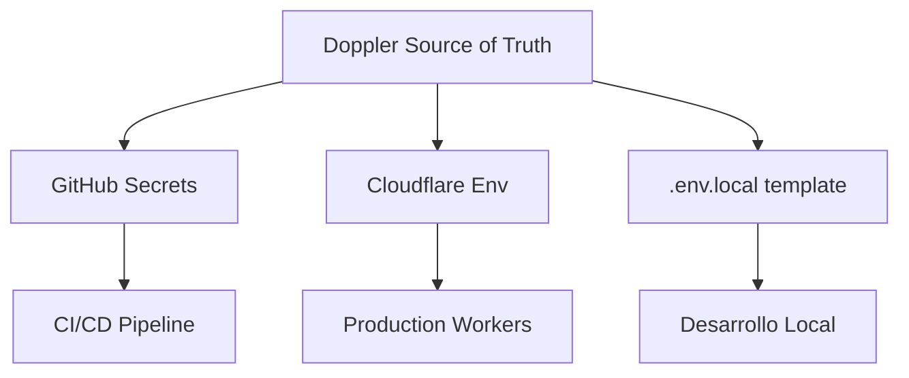

# 2.8.4 Secret Management

> "Los secretos nunca deben estar en el código". Gestión segura de credenciales.

---

## Principios Fundamentales

1. **Zero Hardcoding:** Ninguna credencial en el código fuente
2. **Least Privilege:** Cada servicio solo accede a sus secretos
3. **Rotation Ready:** Todos los secretos deben ser rotables sin downtime
4. **Audit Trail:** Log de todo acceso a secretos

---

## Stack de Gestión

| Ambiente | Solución | Acceso |
|----------|----------|--------|
| **Local** | `.env.local` (gitignored) | Manual |
| **CI/CD** | GitHub Secrets | GitHub Actions |
| **Staging** | Cloudflare Env Vars | Wrangler CLI |
| **Production** | Doppler + Cloudflare | Sync automático |

---

## Jerarquía de Secretos



---

## Secretos por Categoría

### Credenciales Críticas (Rotación cada 90 días)
| Secreto | Servicio | Rotación |
|---------|----------|----------|
| `STRIPE_SECRET_KEY` | Stripe | 90 días |
| `SUPABASE_SERVICE_KEY` | Supabase | 90 días |
| `JWT_SECRET` | Auth interno | 180 días |

### Credenciales Estándar (Rotación anual)
| Secreto | Servicio | Rotación |
|---------|----------|----------|
| `GOOGLE_MAPS_API_KEY` | Google Maps | 1 año |
| `RESEND_API_KEY` | Email | 1 año |
| `SENTRY_DSN` | Monitoring | Nunca |

---

## Comandos de Gestión

```bash
# Sincronizar secretos de Doppler a local
doppler secrets download --no-file --format env > .env.local

# Verificar secretos en producción
npx wrangler secret list

# Rotar un secreto
doppler secrets set STRIPE_SECRET_KEY --project onlycar --config prd
```

---

## Detección de Fugas

- **Pre-commit hook:** Trufflehog escanea commits
- **CI Check:** GitLeaks en cada PR
- **Alertas:** GitHub Secret Scanning habilitado

---

## Relaciones

- Almacena credenciales de: [[Proyecto OnlyCarNLD/Datos/2.3. APIs_credentials|APIs Externas]]
- Utilizado por: [[Proyecto OnlyCarNLD/Datos/2.4. variables_entorno|Variables de Entorno]]
- Auditado por: [[Proyecto OnlyCarNLD/Datos/2.11.1 Logging_Strategy|Sistema de Logs]]

---

## Navegación

| ⬆️ Padre             | [[Proyecto OnlyCarNLD/Datos/2.8. Seguridad_Infraestructura]] |
| -------------------- | ---------------------------------- |
| ⬅️ Hermano anterior  | [[Proyecto OnlyCarNLD/Datos/2.8.3 WAF_Configuration]]        |
| ➡️ Hermano siguiente | [[Proyecto OnlyCarNLD/Datos/2.8.5 DDOS_Protection]]          |

---
