# 2.8.5 DDOS Protection

> Protección contra ataques de denegación de servicio distribuido.

---

## Capas de Protección

```mermaid
flowchart LR
    ATTACK[🔴 DDoS Attack] --> CF[Cloudflare Edge]
    CF --> |Mitigated| DROP[❌ Dropped]
    CF --> |Clean Traffic| ORIGIN[✅ Origin Server]
    
    CF --> L3[Layer 3/4 Protection]
    CF --> L7[Layer 7 Protection]
    CF --> BOT[Bot Management]
```



---

## Configuración Cloudflare

### Layer 3/4 (Network)
| Protección | Estado | Umbral |
|------------|--------|--------|
| **SYN Flood** | Automático | Cloudflare managed |
| **UDP Amplification** | Automático | Cloudflare managed |
| **ICMP Flood** | Automático | Cloudflare managed |

### Layer 7 (Application)
| Protección | Configuración | Acción |
|------------|---------------|--------|
| **HTTP Flood** | 10,000 req/s | Challenge |
| **Slowloris** | Timeout 30s | Drop |
| **Cache Busting** | Query string limit | Block |

---

## Bot Management

| Categoría | Acción | Ejemplo |
|-----------|--------|---------|
| **Verified Bots** | Allow | Googlebot, Bingbot |
| **Likely Automated** | Challenge | Scrapers |
| **Definitely Automated** | Block | DDoS bots |

---

## Modo "Under Attack"

En caso de ataque activo, habilitar manualmente:

```bash
# Via Cloudflare API
curl -X PATCH "https://api.cloudflare.com/client/v4/zones/{zone_id}/settings/security_level" \
  -H "Authorization: Bearer $CF_API_TOKEN" \
  -d '{"value":"under_attack"}'
```

**Efectos:**
- Todos los visitantes pasan por JS Challenge (5s delay)
- Tráfico malicioso reducido > 95%

---

## Alertas de Ataque

| Métrica | Umbral | Notificación |
|---------|--------|--------------|
| Traffic spike | > 500% baseline | Slack + PagerDuty |
| Block rate | > 50% requests | Slack |
| Origin 5xx | > 10% | PagerDuty Critical |

---

## Runbook de Respuesta

1. **Detectar:** Alerta de Cloudflare o Sentry
2. **Evaluar:** Dashboard Analytics → ¿Ataque o viral legítimo?
3. **Mitigar:** Activar "Under Attack Mode" si necesario
4. **Escalar:** Si persiste > 30min, contactar Cloudflare Support

---

## Relaciones

- Complementa: [[Proyecto OnlyCarNLD/Datos/2.8.3 WAF_Configuration|Reglas WAF]]
- Monitorea: [[Proyecto OnlyCarNLD/Datos/2.11.5 Alerting_Strategy|Sistema de Alertas]]
- Documenta: [[Proyecto OnlyCarNLD/Datos/2.19.2 Restore_Procedures|Procedimientos de Emergencia]]

---

## Navegación

| ⬆️ Padre             | [[Proyecto OnlyCarNLD/Datos/2.8. Seguridad_Infraestructura]] |
| -------------------- | ---------------------------------- |
| ⬅️ Hermano anterior  | [[Proyecto OnlyCarNLD/Datos/2.8.4 Secret_Management]]        |
| ➡️ Hermano siguiente | [[Proyecto OnlyCarNLD/Datos/2.8.6 Security_Headers]]         |

---
