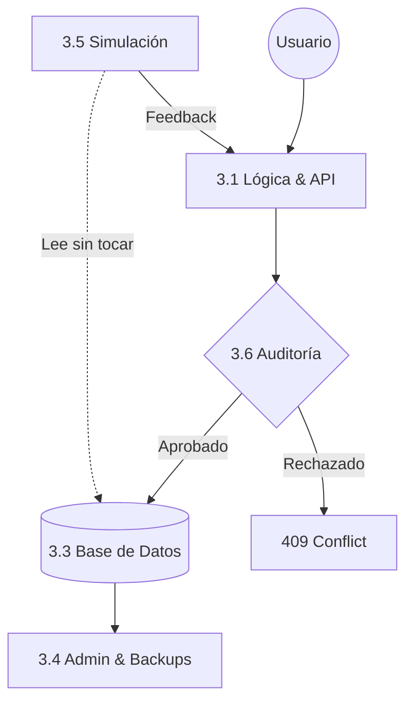

# 3.0 Datos y Lógica

> Lógica de negocio, esquemas de datos y sistemas financieros de OnlyCar.

---

## Visión General

Este módulo contiene toda la lógica de negocio estructurada, desde la configuración 
de precios hasta los sistemas de remuneración y financiamiento para operadores.

### Flujo de Datos Conceptual

---

## Estructura de Hijos

| ID                                  | Nombre                | Descripción                         | Nietos                          | Estado |
| ----------------------------------- | --------------------- | ----------------------------------- | ------------------------------- | ------ |
| [[Proyecto OnlyCarNLD/Datos/3.1. Logica_Negocio_Core\|3.1]]   | Lógica Negocio Core   | Precios, Costos, Pagos, Marketplace | 0 | ✅     |
| [[Proyecto OnlyCarNLD/Datos/3.2. matriz_permisos\|3.2]]       | Matriz Permisos       | Permisos por rol (Antes 3.4)        | 0 | ✅     |
| [[Proyecto OnlyCarNLD/Datos/3.3. reglas_negocio\|3.3]]        | Reglas Negocio        | Reglas de validación (Antes 3.5)    | 0 | ✅     |
| [[Proyecto OnlyCarNLD/Datos/3.4. Administracion_DB\| 3.4]]    | Administración DB     | DevOps, Migraciones (Antes 3.6)     | 0 | ✅     |
| [[Proyecto OnlyCarNLD/Datos/3.5. Simulacion_Financiera\|3.5]] | Simulación Financiera | Monte Carlo (Antes 3.8)             | 0 | ✅     |
| [[Proyecto OnlyCarNLD/Datos/3.6. Auditoria_Logica\|3.6]]      | Auditoría Lógica      | Invariantes (Antes 3.9)             | 0 | ✅     |

---

## Navegación

| ⬆️ Padre             | [[Proyecto OnlyCarNLD/Datos/0. Contexualizador]]           |
| -------------------- | -------------------------------- |
| ⬅️ Hermano anterior  | [[Proyecto OnlyCarNLD/Datos/2.0. tecnologia]]              |
| ➡️ Hermano siguiente | [[Proyecto OnlyCarNLD/Datos/4.0. necesidades_del_sistema]] |

---
