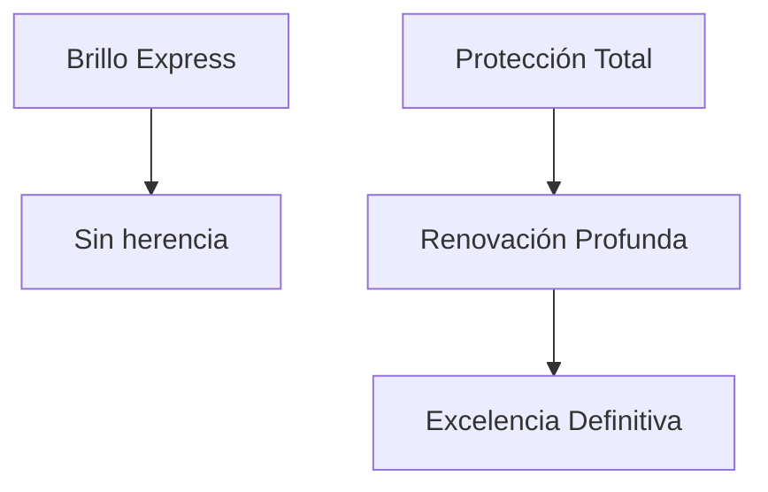

# 3.1.1.2 Paquetes B2C

> Paquetes para cliente consumidor final con sistema de herencia.

---

## Catálogo de Paquetes B2C

| Paquete | Duración | Precio B2C | Hereda De |
|---------|----------|------------|-----------|
| Brillo Express | 55 min | $360 | — |
| Protección Total | 155 min | $710 | — |
| Renovación Profunda | 195 min | $1,430 | Protección Total |
| Excelencia Definitiva | 615 min | $2,860 | Renovación Profunda |

---

## Sistema de Herencia

### Brillo Express
- **Servicios incluidos:** Lavado Exterior Básico + Limpieza/Aspirado Interiores
- **Ideal para:** Mantenimiento rápido

### Protección Total
- **Servicios incluidos:** Lavado Premium + Aspirado + Lavado Asientos + Purificación Extrema
- **Ideal para:** Limpieza profunda con desinfección

### Renovación Profunda
- **Hereda de:** Protección Total
- **Servicios adicionales:** Limpieza Motor + Restauración Faros + Restauración Plásticos
- **Ideal para:** Eliminar desgaste visible

### Excelencia Definitiva
- **Hereda de:** Renovación Profunda
- **Servicios adicionales:** Protección Cerámica + Pulido y Encerado
- **Ideal para:** Acabado espejo premium

---

## Navegación

| ⬆️ Padre             | [[Proyecto OnlyCarNLD/Datos/3.1.1 config_precios_v3.2]]            |
| -------------------- | ---------------------------------------- |
| ⬅️ Hermano anterior  | [[Proyecto OnlyCarNLD/Datos/3.1.1.1 Catalogo_Servicios]]           |
| ➡️ Hermano siguiente | [[Proyecto OnlyCarNLD/Datos/3.1.1.3 Paquetes_B2B]]                 |

---
