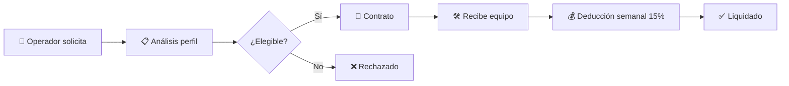

# 3.1.10 Sistema de Financiamiento

> [!NOTE]
> **MÓDULO PREPARADO** — Documentado para implementación futura.
> Se activará cuando la plataforma escale.

---

## Concepto

Sistema de préstamos para equipo y herramientas de trabajo.

```
┌─────────────────────────────────────────────────────────────────┐
│  FINANCIAMIENTO ONLYCAR                                         │
├─────────────────────────────────────────────────────────────────┤
│                                                                 │
│  Operador solicita:   Hidrolavadora Ryobi $8,500                │
│  Análisis de perfil:  ✅ Elegible                               │
│  Tasa asignada:       1.5%                                      │
│  Total a pagar:       $8,627.50                                 │
│                                                                 │
│  Deducción semanal:   15% de ganancias                          │
│  Plazo estimado:      8-12 semanas                              │
│                                                                 │
└─────────────────────────────────────────────────────────────────┘
```



---

## Estructura de Hijos

| ID                                             | Nombre    | Descripción            | Nietos | Estado |
| ---------------------------------------------- | --------- | ---------------------- | ------ | ------ |
| [[Proyecto OnlyCarNLD/Datos/3.1.10.1 prestamos_equipo\|3.1.10.1]]        | Préstamos | Solicitud y aprobación | 0 | ✅      |
| [[Proyecto OnlyCarNLD/Datos/3.1.10.2 deduccion_semanal\|3.1.10.2]]       | Deducción | Cobro automático       | 0 | ✅      |
| [[Proyecto OnlyCarNLD/Datos/3.1.10.3 catalogo_financiable\|3.1.10.3]]    | Catálogo  | Equipo disponible      | 0 | ✅      |
| [[Proyecto OnlyCarNLD/Datos/3.1.10.4 contrato_financiamiento\|3.1.10.4]] | Contrato  | Términos y firma       | 0 | ✅      |

---

## Navegación

| ⬆️ Padre             | [[Proyecto OnlyCarNLD/Datos/3.1. Logica_Negocio_Core]]               |
| -------------------- | -------------------------------- |
| ⬅️ Hermano anterior  | [[Proyecto OnlyCarNLD/Datos/3.1.9 control_caja]]           |
| ➡️ Hermano siguiente | [[Proyecto OnlyCarNLD/Datos/3.1.11 marketplace_operadores]]|

---
