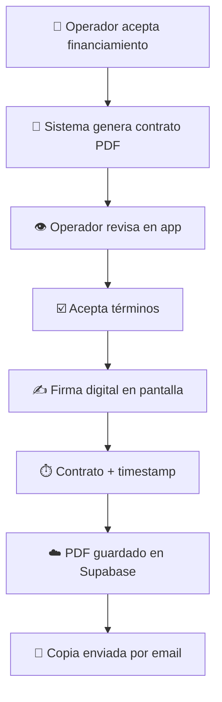

# 3.1.10.4.2 Firma Digital

Proceso de firma electrónica del contrato.

---

## Flujo de Firma

```
Operador acepta financiamiento
        │
        ▼
Sistema genera contrato PDF
        │
        ▼
Operador revisa en app
        │
        ▼
Acepta términos (checkbox)
        │
        ▼
Firma digital (trazo en pantalla)
        │
        ▼
Contrato firmado + timestamp
        │
        ▼
PDF guardado en Supabase Storage
        │
        ▼
Copia enviada por email
```



---

## Validez Legal

- Firma electrónica avanzada (NOM-151-SCFI)
- Timestamp certificado
- Hash del documento
- IP y dispositivo registrados

---

## Navegación

| ⬆️ Padre            | [[Proyecto OnlyCarNLD/Datos/3.1.10.4 contrato_financiamiento]] |
| ------------------- | ------------------------------------ |
| ⬅️ Hermano anterior | [[Proyecto OnlyCarNLD/Datos/3.1.10.4.1 terminos_condiciones]]  |

---
