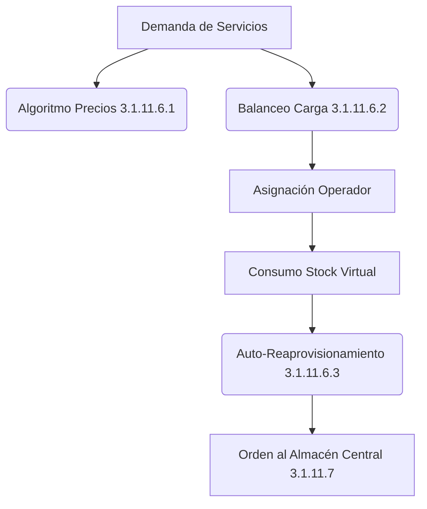

# 3.1.11.6 Lógica de Gestión de Recursos

> "Inteligencia detrás del Marketplace y la Logística del Operador."

---

## Propósito

Este módulo encapsula los **algoritmos de decisión** que optimizan el flujo de recursos en el sistema. No solo gestiona la venta de productos, sino que asegura que los operadores tengan lo que necesitan, cuando lo necesitan, al mejor precio posible.

---

## Componentes Clave

| Módulo | Función |
| :--- | :--- |
| **[[Proyecto OnlyCarNLD/Datos/3.1.11.6.1 algoritmo_ajuste_precios]]** | Ajusta precios de servicios según demanda (Surge Pricing). |
| **[[Proyecto OnlyCarNLD/Datos/3.1.11.6.2 balanceo_carga_operadores]]** | Distribuye la demanda de servicios entre operadores disponibles. |
| **[[Proyecto OnlyCarNLD/Datos/3.1.11.6.3 auto_reaprovisionamiento]]** | Predice agotamiento de stock y genera órdenes de compra automáticas. |

---

## Flujo de Información

---

## Navegación

| ⬆️ Padre             | [[Proyecto OnlyCarNLD/Datos/3.1.11 marketplace_operadores]] |
| -------------------- | --------------------------------- |
| ⬅️ Hermano anterior  | [[Proyecto OnlyCarNLD/Datos/3.1.11.5 inventario_operador]]  |
| ➡️ Hermano siguiente | [[Proyecto OnlyCarNLD/Datos/3.1.11.7 Gestion_Almacen_Central]] |

---
