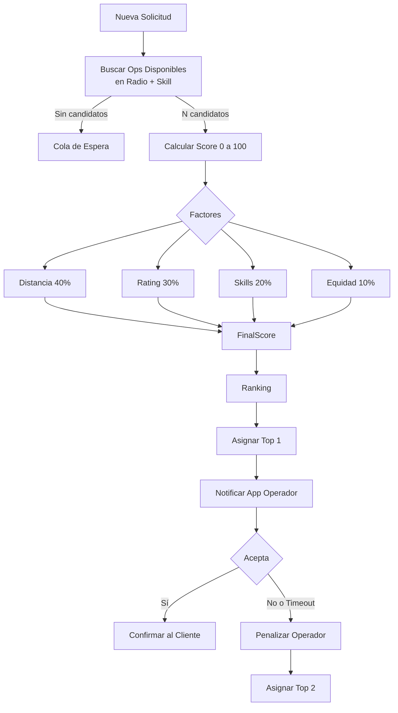

# 3.1.11.6.2 Balanceo de Carga (Smart Dispatch)

> **Misión:** El operador correcto, en el lugar correcto, en el momento correcto.

---

## Heurística de Asignación (Score)

Cuando llega una solicitud, cada operador disponible recibe un `MatchScore` (0-100). El sistema asigna al ganador.

$$
Score = (0.4 * Distancia) + (0.3 * Rating) + (0.2 * Skills) + (0.1 * Fairness)
$$

1.  **Distancia:** Inversamente proporcional al tiempo de llegada.
2.  **Rating:** Preferencia a mejores operadores para clientes VIP.
3.  **Skills:** ¿Sabe hacer "Pulido Cerámico"?
4.  **Fairness:** Penaliza si el operador ya ha tenido muchas citas hoy (distribución equitativa).

### Flujo de Decisión

---

## Optimización de Rutas (Traveling Salesman)

Para citas agendadas:
*   El sistema reordena la cola de trabajos diaria de cada operador para minimizar Km recorridos.
*   **Ahorro estimado:** 15% en tiempo de traslado y gasolina.

---

## Navegación

| ⬆️ Padre | [[Proyecto OnlyCarNLD/Datos/3.1.11.6 Logica_Gestion_Recursos]] |
|----------|---------------------------------|
| ⬅️ Hermano | [[Proyecto OnlyCarNLD/Datos/3.1.11.6.1 algoritmo_ajuste_precios]] |
| ➡️ Hermano | [[Proyecto OnlyCarNLD/Datos/3.1.11.6.3 auto_reaprovisionamiento]] |

---
