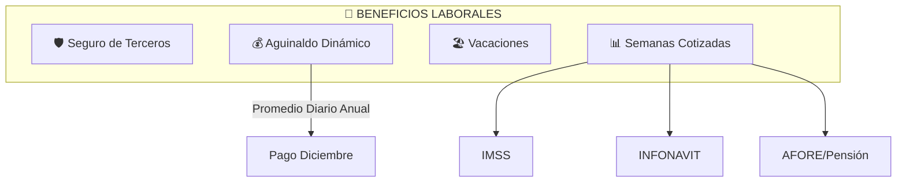

# 3.1.12 Beneficios Laborales

> [!NOTE]
> **MÓDULO FUTURO** — Diseñado para implementación posterior. Define el sistema de prestaciones de ley para Operadores Tecnológicos (GigWorkers).

---

## Concepto

Sistema integral de beneficios para formalizar laboralmente a los Operadores Tecnológicos de OnlyCar, permitiéndoles acceder a prestaciones de ley mexicanas sin una relación de subordinación tradicional.

> [!IMPORTANT]
> **Beneficios Incluidos:**
> - 🛡️ **Seguro de Terceros:** Protección durante servicios.
> - 🎁 **Aguinaldo Dinámico:** Basado en promedio diario anual.
> - 🏖️ **Vacaciones:** Política de ausencias.
> - 📊 **Semanas Cotizadas:** Registro ante IMSS para INFONAVIT/Pensión.

---

## Arquitectura del Sistema

---

## Estructura de Hijos

| ID                                                  | Nombre              | Descripción              | Nietos | Estado |
| --------------------------------------------------- | ------------------- | ------------------------ | ------ | ------ |
| [[Proyecto OnlyCarNLD/Datos/3.1.12.1 seguro_terceros\|3.1.12.1]]              | Seguro              | Protección terceros      | 0 | 📝 futuro |
| [[Proyecto OnlyCarNLD/Datos/3.1.12.2 aguinaldo\|3.1.12.2]]                    | Aguinaldo Dinámico  | Bono basado en promedio  | 0 | 📝 futuro |
| [[Proyecto OnlyCarNLD/Datos/3.1.12.3 vacaciones\|3.1.12.3]]                   | Vacaciones          | Política de ausencias    | 0 | 📝 futuro |
| [[Proyecto OnlyCarNLD/Datos/3.1.12.4 semanas_cotizadas\|3.1.12.4]]            | Semanas Cotizadas   | IMSS/INFONAVIT/Pensión   | 0 | 📝 futuro |

---

## Relaciones con Otros Módulos

- **Depende de:** [[Proyecto OnlyCarNLD/Datos/3.1.8 sistema_remuneracion]] (Fuente de datos de pagos semanales).
- **Referenciado por:** [[Proyecto OnlyCarNLD/Datos/1.2.2 operador_perfil]] (Definición de Operador Tecnológico).

---

## Navegación

| ⬆️ Padre            | [[Proyecto OnlyCarNLD/Datos/3.1. Logica_Negocio_Core]]      |
| ------------------- | --------------------------------- |
| ⬅️ Hermano anterior | [[Proyecto OnlyCarNLD/Datos/3.1.11 marketplace_operadores]] |
| ➡️ Primer hijo      | [[Proyecto OnlyCarNLD/Datos/3.1.12.1 seguro_terceros]]      |

---
