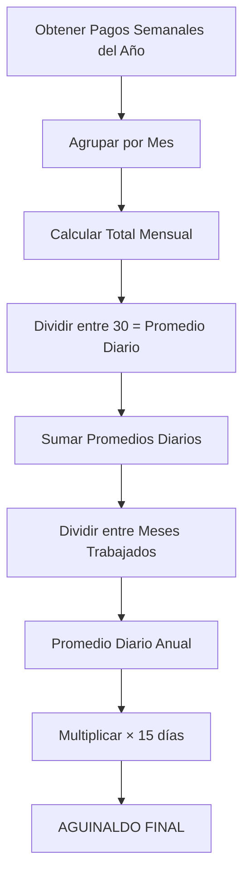

# 3.1.12.2.1 Cálculo Automático

> [!NOTE]
> **MÓDULO FUTURO** — Especificación técnica del algoritmo de cálculo de aguinaldo.

---

## Pseudocódigo del Algoritmo

```typescript
// services/AguinaldoService.ts

interface PagoSemanal {
  semana: number;      // 1-52
  monto: number;       // Pago neto al operador
  fecha_pago: Date;
}

interface MesAgrupado {
  mes: number;         // 1-12
  totalPagos: number;  // Suma de pagos del mes
  promedioDiario: number; // totalPagos / 30
}

async function calcularAguinaldo(operadorId: string, año: number): Promise<number> {
  // 1. Obtener todos los pagos del operador en el año
  const pagosSemanales = await db.pagos_operador
    .select('*')
    .eq('operador_id', operadorId)
    .gte('fecha_pago', `${año}-01-01`)
    .lte('fecha_pago', `${año}-12-31`);

  // 2. Agrupar pagos por mes
  const mesesAgrupados: MesAgrupado[] = [];
  for (let mes = 1; mes <= 12; mes++) {
    const pagosDelMes = pagosSemanales.filter(p => 
      new Date(p.fecha_pago).getMonth() + 1 === mes
    );
    const totalMes = pagosDelMes.reduce((sum, p) => sum + p.monto, 0);
    mesesAgrupados.push({
      mes,
      totalPagos: totalMes,
      promedioDiario: totalMes / 30  // Días fijos por mes
    });
  }

  // 3. Calcular promedio diario ANUAL
  const mesesTrabajados = mesesAgrupados.filter(m => m.totalPagos > 0);
  const sumaPromediosDiarios = mesesTrabajados.reduce(
    (sum, m) => sum + m.promedioDiario, 0
  );
  const promedioDiarioAnual = sumaPromediosDiarios / mesesTrabajados.length;

  // 4. Aplicar fórmula LFT México (15 días mínimo)
  const DIAS_AGUINALDO = 15;
  const aguinaldo = promedioDiarioAnual * DIAS_AGUINALDO;

  return aguinaldo;
}
```

---

## Diagrama de Flujo



---

## Casos Especiales

| Caso | Comportamiento |
|------|----------------|
| Operador con < 12 meses | Se divide entre meses efectivamente trabajados |
| Mes sin ingresos | No cuenta para el divisor |
| Operador nuevo (< 1 mes) | Aguinaldo proporcional: (días trabajados / 365) × fórmula |

---

## Navegación

| ⬆️ Padre             | [[Proyecto OnlyCarNLD/Datos/3.1.12.2 aguinaldo]]               |
| -------------------- | ------------------------------------ |
| ➡️ Hermano siguiente | [[Proyecto OnlyCarNLD/Datos/3.1.12.2.2 factores_evaluacion]]   |

---
