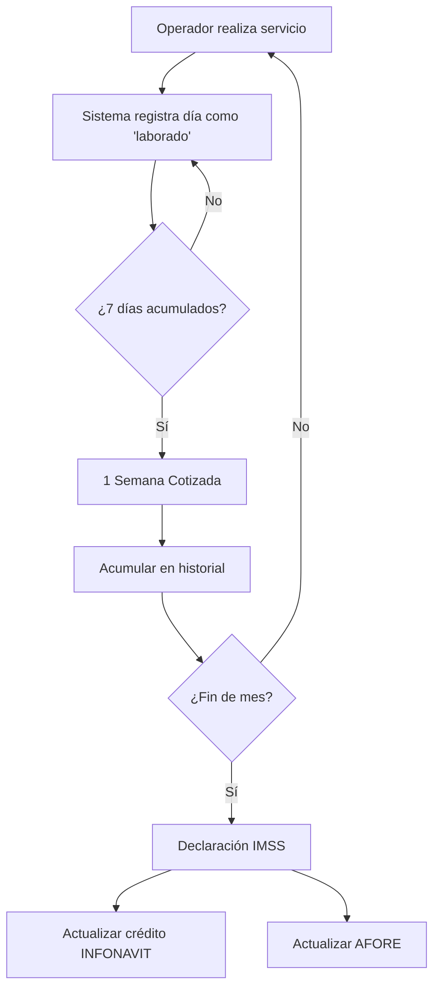

# 3.1.12.4 Semanas Cotizadas

> [!NOTE]
> **MÓDULO FUTURO** — Diseñado para implementación posterior. Define el sistema de conteo de días trabajados para integración con beneficios gubernamentales mexicanos.

---

## Concepto

OnlyCar busca formalizar a sus Operadores Tecnológicos (GigWorkers) mediante un sistema de **acumulación de días trabajados** que les permita acceder a beneficios de seguridad social mexicanos.

> [!IMPORTANT]
> **Beneficios Potenciales:**
> - **IMSS:** Acceso a servicios de salud.
> - **INFONAVIT:** Créditos para vivienda.
> - **AFORE/Pensión:** Ahorro para el retiro.
>
> Esto transforma al operador de "trabajador informal" a "trabajador con prestaciones de ley".

---

## Arquitectura del Sistema

```
┌─────────────────────────────────────────────────────────────────┐
│  SISTEMA DE SEMANAS COTIZADAS                                   │
├─────────────────────────────────────────────────────────────────┤
│                                                                 │
│  📊 REGISTRO DE DÍAS                                            │
│      → Cada día con ≥1 servicio = 1 día cotizado               │
│      → 7 días cotizados = 1 semana cotizada                     │
│                                                                 │
│  📤 DECLARACIÓN PATRONAL                                        │
│      → OnlyCar actúa como "patrón" ante IMSS                    │
│      → Reporte mensual de semanas cotizadas por operador        │
│                                                                 │
│  🎁 ACCESO A BENEFICIOS                                         │
│      → 52 semanas = 1 año cotizado                              │
│      → Desbloquea INFONAVIT, créditos AFORE                     │
│                                                                 │
└─────────────────────────────────────────────────────────────────┘
```

---

## Flujo de Acumulación



---

## Estructura de Hijos

| ID                                                   | Nombre                     | Descripción                    | Estado |
| ---------------------------------------------------- | -------------------------- | ------------------------------ | ------ |
| [[Proyecto OnlyCarNLD/Datos/3.1.12.4.1 registro_dias\|3.1.12.4.1]]             | Registro de Días           | Conteo de días laborados       | 📝 futuro |
| [[Proyecto OnlyCarNLD/Datos/3.1.12.4.2 integracion_imss\|3.1.12.4.2]]          | Integración IMSS           | Declaración patronal           | 📝 futuro |
| [[Proyecto OnlyCarNLD/Datos/3.1.12.4.3 beneficios_gubernamentales\|3.1.12.4.3]]| Beneficios Gubernamentales | INFONAVIT, Pensión, AFORE      | 📝 futuro |

---

## Navegación

| ⬆️ Padre             | [[Proyecto OnlyCarNLD/Datos/3.1.12 beneficios_laborales]]  |
| -------------------- | -------------------------------- |
| ⬅️ Hermano anterior  | [[Proyecto OnlyCarNLD/Datos/3.1.12.3 vacaciones]]          |
| ➡️ Primer hijo       | [[Proyecto OnlyCarNLD/Datos/3.1.12.4.1 registro_dias]]     |

---
