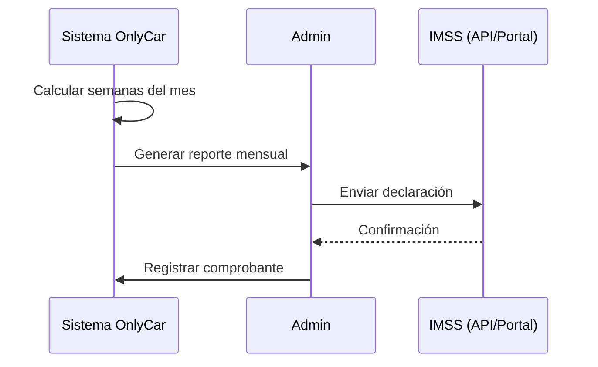
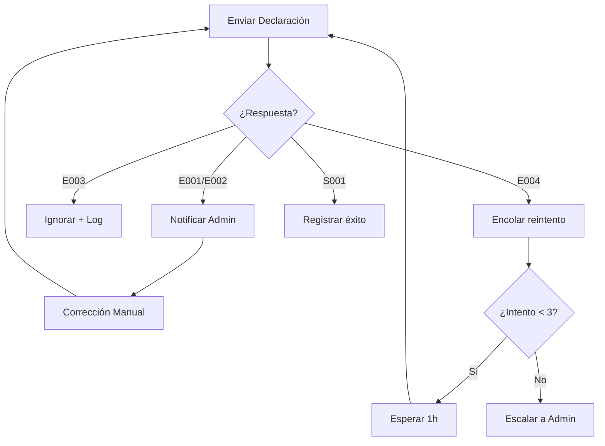

# 3.1.12.4.2 Integración IMSS

> [!NOTE]
> **MÓDULO FUTURO** — Proceso de integración con el Instituto Mexicano del Seguro Social.

---

## Modelo de Integración

OnlyCar actuaría como **patrón** ante el IMSS, reportando las semanas cotizadas de cada operador de forma mensual.

> [!CAUTION]
> **Implicaciones Legales:**
> Este modelo implica una relación laboral formal. Se requiere asesoría legal especializada antes de implementar.

---

## Flujo de Declaración



---

## Datos Requeridos por Operador

| Dato | Descripción | Fuente |
|------|-------------|--------|
| CURP | Clave Única de Registro | Registro operador |
| NSS | Número de Seguro Social | Captura o alta |
| Semanas | Semanas cotizadas del mes | Sistema |
| SDI | Salario Diario Integrado | Calculado |

---

## Manejo de Errores

### Estructura de Respuesta IMSS

```typescript
interface RespuestaIMSS {
  exitoso: boolean;
  codigo: string;      // E001, E002, E003, S001
  mensaje: string;
  reintentable: boolean;
}
```

### Códigos de Error Comunes

| Código | Causa | Acción del Sistema | Notificación |
|--------|-------|-------------------|--------------|
| `E001` | NSS inválido o inexistente | Marcar operador para corrección | Admin + Operador |
| `E002` | SDI fuera de límites IMSS | Recalcular con topes legales | Solo Admin |
| `E003` | Declaración duplicada | Omitir y registrar en log | Solo Log |
| `E004` | Servicio IMSS no disponible | Reintentar en 1 hora | Solo Sistema |
| `S001` | Éxito | Registrar comprobante | Admin |

### Flujo de Reintento



### Tabla: `imss_declaraciones_log`

| Columna | Tipo | Descripción |
|---------|------|-------------|
| `id` | UUID | PK |
| `operador_id` | UUID | FK operadores |
| `mes` | Int | Mes de declaración (1-12) |
| `año` | Int | Año de declaración |
| `codigo_respuesta` | String | E001, S001, etc. |
| `intentos` | Int | Número de intentos |
| `exitoso` | Boolean | true si S001 |
| `timestamp` | DateTime | Fecha del último intento |

---

## Navegación

| ⬆️ Padre             | [[Proyecto OnlyCarNLD/Datos/3.1.12.4 semanas_cotizadas]]           |
| -------------------- | ---------------------------------------- |
| ⬅️ Hermano anterior  | [[Proyecto OnlyCarNLD/Datos/3.1.12.4.1 registro_dias]]             |
| ➡️ Hermano siguiente | [[Proyecto OnlyCarNLD/Datos/3.1.12.4.3 beneficios_gubernamentales]]|

---
