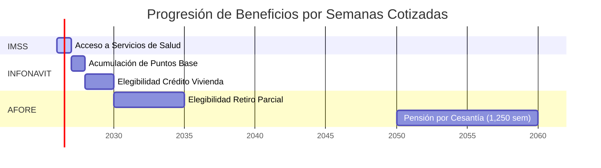

# 3.1.12.4.3 Beneficios Gubernamentales

> [!NOTE]
> **MÓDULO FUTURO** — Descripción de los beneficios desbloqueados por semanas cotizadas.

---

## Beneficios por Semanas Acumuladas

| Semanas | Años | Beneficio Desbloqueado |
|---------|------|------------------------|
| 52 | 1 | Acceso a servicios IMSS |
| 104 | 2 | Puntos INFONAVIT para crédito vivienda |
| 500 | ~10 | Elegibilidad para pensión mínima |
| 1,250 | ~24 | Pensión completa por cesantía |

---

## INFONAVIT

El Instituto del Fondo Nacional de la Vivienda para los Trabajadores otorga créditos para:
- Compra de vivienda.
- Construcción.
- Remodelación.

**Requisito:** Acumular puntos basados en edad + salario + semanas cotizadas.

---

## AFORE / Pensión

El Administrador de Fondos para el Retiro permite:
- Ahorro para el retiro.
- Retiro parcial por desempleo.
- Pensión al cumplir requisitos de edad y semanas.

---

## Línea de Tiempo de Beneficios

La siguiente visualización muestra la progresión temporal esperada de beneficios para un operador que inicia cotizaciones en 2026:

> [!TIP]
> **Nota:** Los tiempos son aproximados y dependen de la frecuencia de trabajo del operador. Un operador que trabaje 52 semanas/año alcanzará los hitos más rápido que uno intermitente.

---

## Navegación

| ⬆️ Padre             | [[Proyecto OnlyCarNLD/Datos/3.1.12.4 semanas_cotizadas]]       |
| -------------------- | ------------------------------------ |
| ⬅️ Hermano anterior  | [[Proyecto OnlyCarNLD/Datos/3.1.12.4.2 integracion_imss]]      |

---
