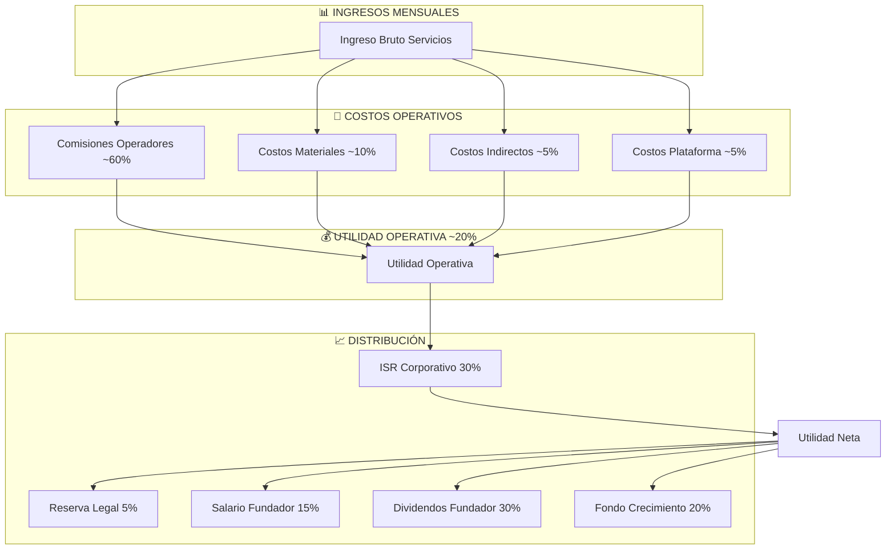

# 3.1.13 Sistema Ganancias Fundador

> Sistema de distribución de utilidades para el fundador de OnlyCar.

---

## Aplicabilidad por Fase

> [!IMPORTANT]
> **Este módulo documenta el modelo MADURO de distribución.**
> En fases tempranas, la estrategia difiere significativamente.

| Fase | Operadores | Aplicabilidad | Nota |
|------|------------|---------------|------|
| 0-1 | 0-10 | ⏸️ **DIFERIDO** | Reinversión 100% |
| 2 | 10-50 | 🔄 **TRANSICIÓN** | Salario opcional |
| 3+ | 50+ | ✅ **APLICABLE** | Distribución completa |

→ Ver contexto completo: [[Proyecto OnlyCarNLD/Datos/3.1.15 estructura_organizacional]]
→ Ver roadmap de activación: [[Proyecto OnlyCarNLD/Datos/9.3 plan_escalamiento_empresarial]]

---

## Distribución por Fase

### Fase 0-1 (0-10 operadores): Reinversión Total

| Destino Nominal | % | Uso Real |
|-----------------|---|----------|
| Salario Fundador | 15% | → Infraestructura |
| Dividendos | 30% | → Marketing |
| Fondo Crecimiento | 20% | → Legal/Marca |
| Reservas | 30% | → Buffer operativo |
| Reserva Legal | 5% | ✅ Obligatorio LGSM |

### Fase 2 (10-50 operadores): Transición

| Destino | % |
|---------|---|
| Reinversión | 60% |
| Salario Fundador | 15% (si viable, piso $10K) |
| Staff (freelancer) | 15% |
| Reservas | 10% |

### Fase 3+ (50+ operadores): Modelo Completo

> Modelo estándar documentado abajo.

---

## Flujo de Distribución (Fase 3+)

---

## Distribución de Utilidad Neta (Fase 3+)

| Destino | % | Descripción | Frecuencia |
|---------|---|-------------|------------|
| **Reserva Legal** | 5% | Obligatorio LGSM hasta 20% capital | Anual |
| **Salario Fundador** | 15% | Compensación mensual estable | Mensual |
| **Dividendos Fundador** | 30% | Reparto de ganancias | Trimestral |
| **Fondo Crecimiento** | 20% | Reinversión estratégica | Mensual |
| **Reserva Contingencia** | 10% | Buffer emergencias | Continuo |
| **Reserva Tecnología** | 10% | Desarrollo e infraestructura | Continuo |
| **Capitalización Social** | 10% | Aumento capital social | Anual |

---

## Estructura de Hijos

| ID | Nombre | Descripción | Nietos | Estado |
|----|--------|-------------|--------|--------|
| [[Proyecto OnlyCarNLD/Datos/3.1.13.1 compensacion_mensual\|3.1.13.1]] | Compensación Mensual | Salario base fundador | 0 | 🔮 |
| [[Proyecto OnlyCarNLD/Datos/3.1.13.2 distribucion_dividendos\|3.1.13.2]] | Distribución Dividendos | Política de reparto | 0 | 🔮 |
| [[Proyecto OnlyCarNLD/Datos/3.1.13.3 reserva_legal\|3.1.13.3]] | Reserva Legal | Fondo obligatorio LGSM | 0 | 🔮 |
| [[Proyecto OnlyCarNLD/Datos/3.1.13.4 fondo_crecimiento\|3.1.13.4]] | Fondo Crecimiento | Reinversión estratégica | 0 | 🔮 |

---

## Integraciones

→ Ver costos: [[Proyecto OnlyCarNLD/Datos/3.1.7 sistema_costos]]
→ Ver remuneración operadores: [[Proyecto OnlyCarNLD/Datos/3.1.8 sistema_remuneracion]]
→ Ver beneficios laborales: [[Proyecto OnlyCarNLD/Datos/3.1.12 beneficios_laborales]]
→ Ver finanzas empresa: [[Proyecto OnlyCarNLD/Datos/3.1.14 finanzas_corporativas]]

---

## Navegación

| ⬆️ Padre | [[Proyecto OnlyCarNLD/Datos/3.1. Logica_Negocio_Core]] |
|----------|------------------------------|
| ⬅️ Hermano anterior | [[Proyecto OnlyCarNLD/Datos/3.1.12 beneficios_laborales]] |
| ➡️ Hermano siguiente | [[Proyecto OnlyCarNLD/Datos/3.1.14 finanzas_corporativas]] |

---
