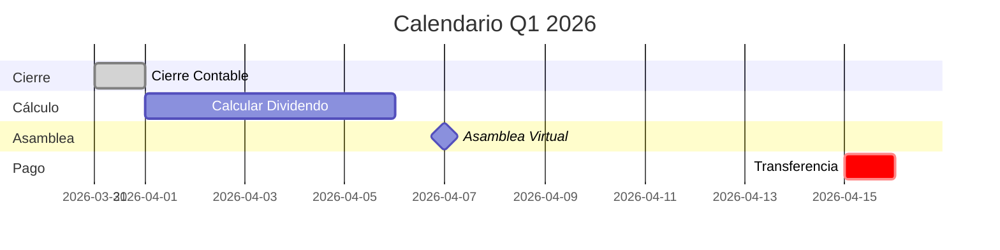

# 3.1.13.2.2 Calendario Fiscal

> Cronograma de pagos alineado con obligaciones SAT.

---

## Calendario Anual de Dividendos

| Trimestre | Período | Cierre | Cálculo | Asamblea | Pago |
|-----------|---------|--------|---------|----------|------|
| **Q1** | Ene-Mar | 31 Mar | 1-5 Abr | 7 Abr | **15 Abr** |
| **Q2** | Abr-Jun | 30 Jun | 1-5 Jul | 7 Jul | **15 Jul** |
| **Q3** | Jul-Sep | 30 Sep | 1-5 Oct | 7 Oct | **15 Oct** |
| **Q4** | Oct-Dic | 31 Dic | 1-5 Ene | 7 Ene | **15 Ene** |

---

## Flujo Temporal

---

## Obligaciones Fiscales

| Obligación | Fecha Límite | Responsable |
|------------|--------------|-------------|
| Retención ISR 10% | Día del pago | Empresa |
| Declaración ISR | 17 del mes siguiente | Contabilidad |
| CFDI Dividendo | Día del pago | Contabilidad |
| Acta Asamblea | Antes del pago | Abogado |

---

## Alertas Automáticas

> [!WARNING]
> **Recordatorios programados:**
> - 📅 **5 días antes del cierre:** Revisar utilidad preliminar
> - 📅 **Día 1 post-cierre:** Iniciar cálculo formal
> - 📅 **Día 14:** Confirmar transferencia programada

---

## Navegación

| ⬆️ Padre | [[Proyecto OnlyCarNLD/Datos/3.1.13.2 distribucion_dividendos]] |
|----------|--------------------------------------|
| ⬅️ Hermano anterior | [[Proyecto OnlyCarNLD/Datos/3.1.13.2.1 calculo_dividendo]] |

---
