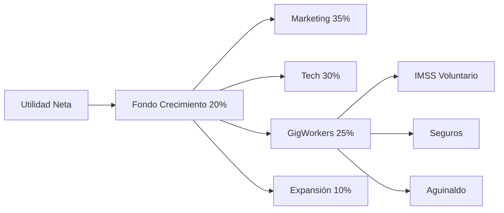

# 3.1.13.4 Fondo de Crecimiento

> Reinversión estratégica para expansión de OnlyCar.

---

## Modelo On-Demand

> [!IMPORTANT]
> **Los Operadores de OnlyCar son GigWorkers independientes**, no empleados contratados.
> Por lo tanto, este fondo NO incluye "contratación" sino **apoyo a prestaciones de ley opcionales**.

---

## Distribución del Fondo (20% Utilidad Neta)

| Categoría | % del Fondo | Ejemplos | Monto Ejemplo* |
|-----------|-------------|----------|----------------|
| **Marketing Digital** | 35% | Ads, influencers, eventos B2B | $2,450 |
| **Tecnología** | 30% | Servidores, APIs, desarrollo | $2,100 |
| **Prestaciones GigWorkers** | 25% | Seguros, IMSS voluntario | $1,750 |
| **Expansión Geográfica** | 10% | Nuevas ciudades, licencias | $700 |

*Basado en utilidad neta mensual de $35,000 (20% = $7,000)

---

## Prestaciones GigWorkers

> [!TIP]
> **¿Por qué "Prestaciones GigWorkers" en lugar de "Contratación"?**
> - OnlyCar opera bajo modelo **economía gig** (on-demand)
> - Los operadores se registran libremente, no son "contratados"
> - El fondo financia acceso voluntario a beneficios

### Beneficios Financiables

| Beneficio | Cobertura | Referencia |
|-----------|-----------|------------|
| IMSS Voluntario | Hasta 50% de cuota | [[Proyecto OnlyCarNLD/Datos/3.1.12.4 semanas_cotizadas]] |
| Seguro de Daños | 100% de prima | [[Proyecto OnlyCarNLD/Datos/3.1.12.1 seguro_terceros]] |
| Aguinaldo Dinámico | Variable por desempeño | [[Proyecto OnlyCarNLD/Datos/3.1.12.2 aguinaldo]] |
| Fondo de Ahorro | Match hasta 5% | [[Proyecto OnlyCarNLD/Datos/3.1.12 beneficios_laborales]] |

---

## Flujo de Asignación

---

## Navegación

| ⬆️ Padre | [[Proyecto OnlyCarNLD/Datos/3.1.13 sistema_ganancias_fundador]] |
|----------|---------------------------------------|
| ⬅️ Hermano anterior | [[Proyecto OnlyCarNLD/Datos/3.1.13.3 reserva_legal]] |

---
