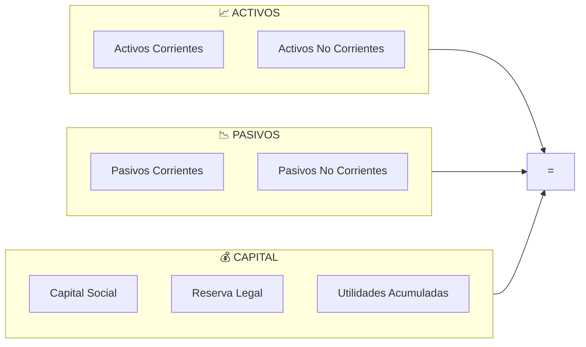

# 3.1.14.1 Balance General

> Fotografía financiera de OnlyCar en un momento dado.

---

## Estructura del Balance

**Ecuación Contable:** `Activos = Pasivos + Capital`

---

## Activos

### Activos Corrientes (Liquidez < 1 año)

| Cuenta | Descripción | Ejemplo OnlyCar |
|--------|-------------|-----------------|
| Caja y Bancos | Efectivo disponible | $120,000 |
| Cuentas por Cobrar | Pagos pendientes B2B | $45,000 |
| Inventario Marketplace | Stock productos | $30,000 |

### Activos No Corrientes (> 1 año)

| Cuenta | Descripción | Ejemplo |
|--------|-------------|---------|
| Equipo de Cómputo | Servidores, laptops | $80,000 |
| Intangibles | Marca, desarrollo app | $150,000 |
| Depósitos | Garantías oficinas | $25,000 |

---

## Pasivos

### Pasivos Corrientes (< 1 año)

| Cuenta | Descripción | Ejemplo |
|--------|-------------|---------|
| Proveedores | Cuentas por pagar | $35,000 |
| Impuestos por pagar | ISR, IVA pendiente | $25,000 |
| Comisiones pendientes | Pago a operadores | $60,000 |

### Pasivos No Corrientes (> 1 año)

| Cuenta | Descripción | Ejemplo |
|--------|-------------|---------|
| Préstamos bancarios | Crédito PyME | $50,000 |

---

## Capital Contable

| Cuenta | Descripción | Ejemplo |
|--------|-------------|---------|
| Capital Social | Aportaciones accionistas | $500,000 |
| Reserva Legal | 5% utilidades (LGSM) | $100,000 |
| Utilidades Acumuladas | Ganancias retenidas | $180,000 |

---

## Navegación

| ⬆️ Padre | [[Proyecto OnlyCarNLD/Datos/3.1.14 finanzas_corporativas]] |
|----------|----------------------------------|
| ➡️ Hermano siguiente | [[Proyecto OnlyCarNLD/Datos/3.1.14.2 flujo_efectivo]] |

---
