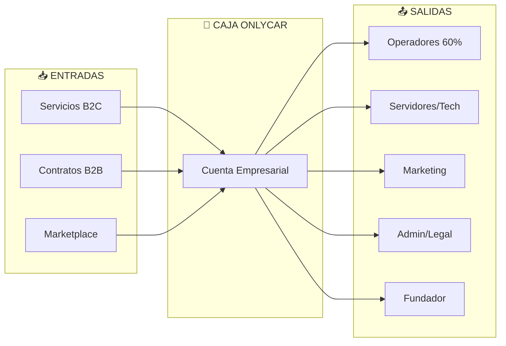

# 3.1.14.2 Flujo de Efectivo

> Movimiento de dinero dentro y fuera de OnlyCar.

---

## Diagrama de Flujo

---

## Entradas de Efectivo

| Fuente | % del Total | Frecuencia | Canal |
|--------|-------------|------------|-------|
| **Servicios B2C** | 65% | Continuo | Stripe/MP |
| **Contratos B2B** | 30% | Mensual | Factura |
| **Marketplace** | 5% | Continuo | App |

---

## Salidas de Efectivo

| Destino | % Ingreso | Frecuencia | Prioridad |
|---------|-----------|------------|-----------|
| **Comisiones Operadores** | 55-60% | Semanal | 🔴 Crítico |
| **Tecnología (Servers, APIs)** | 5% | Mensual | 🟡 Alta |
| **Marketing** | 5-8% | Variable | 🟢 Media |
| **Admin/Legal** | 3% | Mensual | 🟢 Media |
| **Salario Fundador** | 3% | Mensual | 🟡 Alta |
| **Reservas** | 5-10% | Mensual | 🔴 Crítico |

---

## Estado de Flujo Mensual

| Concepto | Enero | Febrero | Marzo |
|----------|-------|---------|-------|
| **Entradas** | $250K | $280K | $310K |
| (-) Comisiones | -$150K | -$168K | -$186K |
| (-) Tech | -$12K | -$14K | -$15K |
| (-) Marketing | -$15K | -$20K | -$25K |
| (-) Admin | -$8K | -$8K | -$8K |
| (-) Fundador | -$25K | -$28K | -$30K |
| **Flujo Neto** | **$40K** | **$42K** | **$46K** |

---

## Navegación

| ⬆️ Padre | [[Proyecto OnlyCarNLD/Datos/3.1.14 finanzas_corporativas]] |
|----------|----------------------------------|
| ⬅️ Hermano anterior | [[Proyecto OnlyCarNLD/Datos/3.1.14.1 balance_general]] |
| ➡️ Hermano siguiente | [[Proyecto OnlyCarNLD/Datos/3.1.14.3 kpis_corporativos]] |

---
