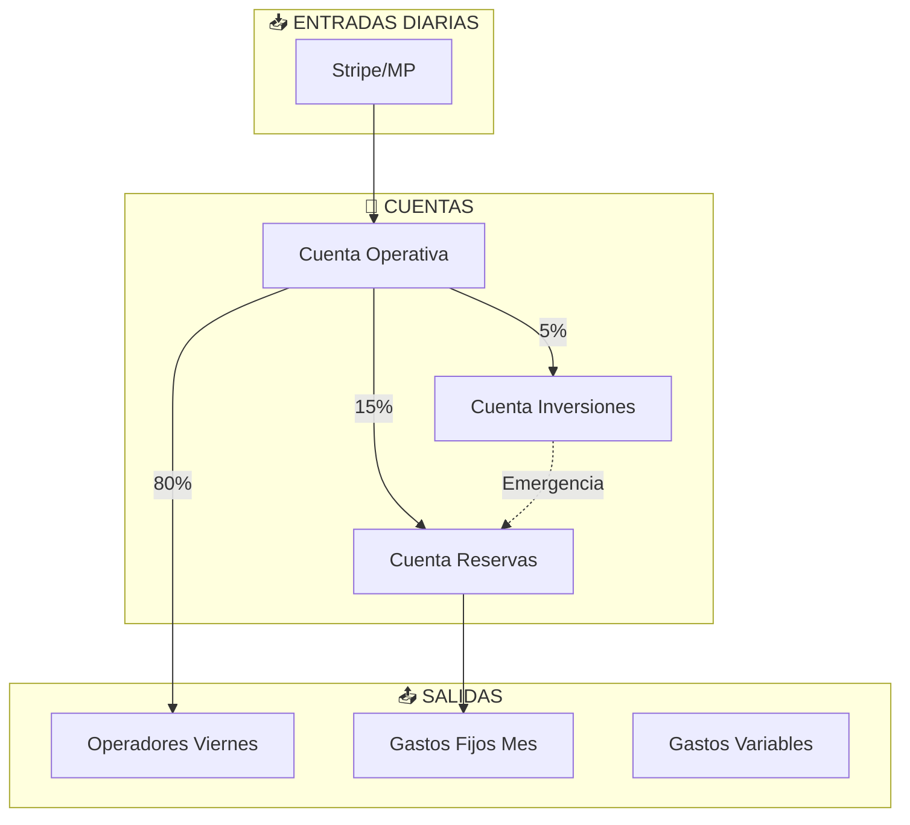

# 3.1.14.4 Tesorería

> Gestión de liquidez y reservas de OnlyCar.

---

## Gestión de Tesorería por Fase

| Fase | Estrategia | Prioridades de Caja |
|------|------------|---------------------|
| **0-1** | **Supervivencia** | 1. Comisiones Ops (semanal)<br>2. Infraestructura Tech<br>3. Marketing mínimo |
| **2** | **Estabilización** | 1. Buffer 3 meses<br>2. Primer staff (freelance)<br>3. Reinversión agresiva |
| **3+** | **Crecimiento** | 1. Runway 6+ meses<br>2. Reservas formales<br>3. Dividendos |

### Prioridad de Pagos (Fase 0-1)

```
1. Comisiones operadores (semanal) ← CRÍTICO (innegociable)
2. Infraestructura tech ($600/mes) ← CRÍTICO (servidores) 
3. Marketing mínimo ← VARIABLE (lo que sobre)
4. Salario fundador ← DIFERIDO ($0)
```

---

## Estructura de Reservas (Fase Madura)

| Tipo Reserva | % Utilidad | Propósito | Acceso |
|--------------|------------|-----------|--------|
| **Reserva Legal** | 5% | Obligatorio LGSM | Solo pérdidas |
| **Reserva Contingencia** | 10% | Emergencias operativas | Aprobación Fundador |
| **Reserva Tecnología** | 10% | Infraestructura y desarrollo | Presupuesto anual |
| **Fondo Liquidez Inmediata** | Variable | Pagos semanales operadores | Automático |

---

## Política de Liquidez

> [!IMPORTANT]
> **Regla de Oro de Tesorería:**
> - Mantener **mínimo 3 semanas** de comisiones pendientes en caja
> - **Nunca** usar reserva legal para operaciones normales
> - **Runway mínimo:** 6 meses de gastos fijos (Fase 3+)

---

## Flujo de Tesorería



---

## Estrategia de Excedentes

| Plazo | Instrumento | Rendimiento Esperado | Liquidez |
|-------|-------------|---------------------|----------|
| Inmediato | CETES 28 días | 11% anual | 1 día |
| Corto | Pagaré bancario | 9% anual | 7-28 días |
| Mediano | FIBRAS | 8-10% anual | 30-90 días |

---

## Conciliación Bancaria

| Frecuencia | Responsable | Herramienta |
|------------|-------------|-------------|
| Diaria | Automático | Supabase + Stripe API |
| Semanal | Contabilidad | Reporte manual |
| Mensual | Auditoría | INE + extractos |

---

## Navegación

| ⬆️ Padre | [[Proyecto OnlyCarNLD/Datos/3.1.14 finanzas_corporativas]] |
|----------|----------------------------------|
| ⬅️ Hermano anterior | [[Proyecto OnlyCarNLD/Datos/3.1.14.3 kpis_corporativos]] |

---
