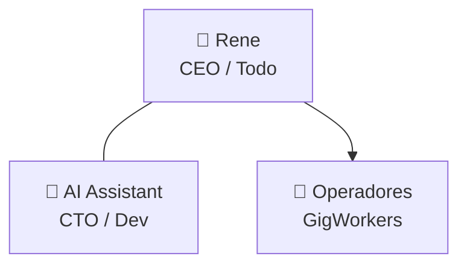
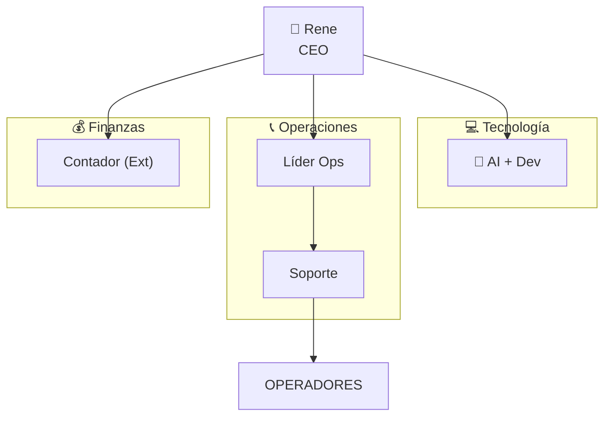

# 3.1.15.2 Organigrama por Fase

> Evolución visual de la estructura de mando.

---

## Fase 1-2: Estructura Plana (MVP)

> **Nota:** En Fase 2 (10-50 ops) se añade un **Freelancer de Soporte** part-time reportando a Rene.

---

## Fase 3+: Estructura Departamental

---

## Roles Clave Fase 3

| Rol | Tipo | Responsabilidad Primaria |
|-----|------|--------------------------|
| **Líder Ops** | Full-time | Calidad de servicio y gestión de flota |
| **Soporte** | Full-time | Atención tiempo real (WhatsApp) |
| **Contador** | Outsourced | Nómina, SAT, Declaraciones |
| **Dev** | Contractor | Mantenimiento plataforma |

---

## Navegación

| ⬆️ Padre | [[Proyecto OnlyCarNLD/Datos/3.1.15 estructura_organizacional]] |
|----------|--------------------------------------|
| ⬅️ Hermano anterior | [[Proyecto OnlyCarNLD/Datos/3.1.15.1 fases_crecimiento]] |
| ➡️ Hermano siguiente | [[Proyecto OnlyCarNLD/Datos/3.1.15.3 costos_nomina]] |

---
