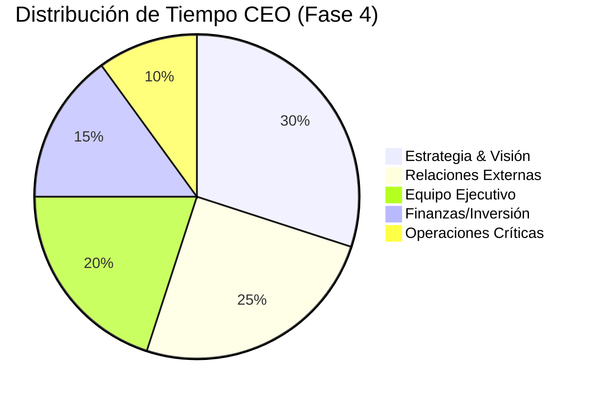

# 3.1.15.4 Rol del Fundador

> Evolución de responsabilidades de Rene a medida que OnlyCar escala.

---

## Evolución de Tareas

| Área | Fase 1 (MVP) | Fase 2 (Estable) | Fase 3 (Crecimiento) | Fase 4 (CEO) |
|------|-------------|------------------|----------------------|--------------|
| **Código** | Escribe/Revisa | Revisa/Supervisa | Define arquitectura | Solo visión |
| **Soporte** | Atiende directo | Supervisa freelance | Delega a Ops Mgr | N/A |
| **Ventas** | Cierra todo | Cierra grandes | Estrategia comercial | M&A / Partners |
| **Finanzas** | Hace pagos | Revisa reportes | Revisa auditoría | Fundraising |

---

## El Día a Día del CEO (Fase 4)

> [!IMPORTANT]
> **Meta:** Dejar de trabajar **EN** el negocio (operar) para trabajar **SOBRE** el negocio (dirigir).

---

## Navegación

| ⬆️ Padre | [[Proyecto OnlyCarNLD/Datos/3.1.15 estructura_organizacional]] |
|----------|--------------------------------------|
| ⬅️ Hermano anterior | [[Proyecto OnlyCarNLD/Datos/3.1.15.3 costos_nomina]] |

---
