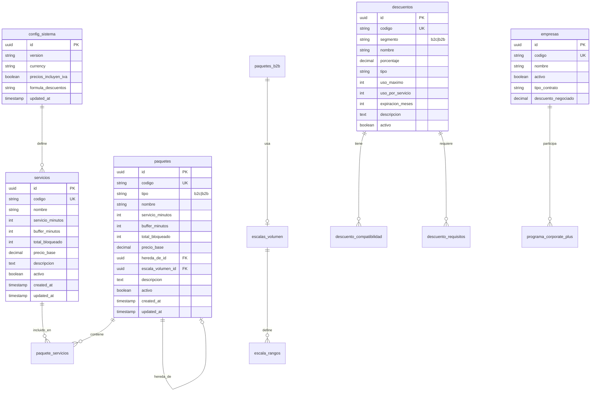

# 3.1.4 Esquema SQL - Lógica de Negocio

**Stack:** Supabase/PostgreSQL  
**Seguridad:** RLS habilitado en todas las tablas

---

### Diagrama de Entidades



---

### Tablas Principales

#### 1. config_sistema

```sql
-- Configuración global del sistema
CREATE TABLE IF NOT EXISTS config_sistema (
  id UUID PRIMARY KEY DEFAULT gen_random_uuid(),
  version VARCHAR(20) NOT NULL DEFAULT '3.2.1',
  currency VARCHAR(3) NOT NULL DEFAULT 'MXN',
  precios_incluyen_iva BOOLEAN DEFAULT true,
  formula_descuentos_acumulados TEXT DEFAULT '1 - ((1 - d1/100) * (1 - d2/100) * (1 - d3/100))',
  
  -- Validaciones
  descuento_max DECIMAL(5,2) DEFAULT 100,
  descuento_min DECIMAL(5,2) DEFAULT 0,
  precio_min DECIMAL(10,2) DEFAULT 50,
  duracion_minutos_min INTEGER DEFAULT 10,
  buffer_minutos_default INTEGER DEFAULT 15,
  redondeo_multiplo INTEGER DEFAULT 10,
  
  -- Factores de precio
  factor_base DECIMAL(4,2) DEFAULT 1.0,
  factor_b2c DECIMAL(4,2) DEFAULT 0.7,
  factor_b2b DECIMAL(4,2) DEFAULT 0.45,
  
  updated_at TIMESTAMPTZ DEFAULT NOW(),
  updated_by UUID REFERENCES auth.users(id)
);

-- Solo puede existir un registro
CREATE UNIQUE INDEX idx_config_unica ON config_sistema ((true));
```

---

#### 2. servicios

```sql
-- Catálogo de servicios individuales
CREATE TABLE IF NOT EXISTS servicios (
  id UUID PRIMARY KEY DEFAULT gen_random_uuid(),
  codigo VARCHAR(100) NOT NULL UNIQUE,
  nombre VARCHAR(200) NOT NULL,
  
  -- Duración
  servicio_minutos INTEGER NOT NULL CHECK (servicio_minutos > 0),
  buffer_minutos INTEGER DEFAULT 15,
  total_bloqueado INTEGER GENERATED ALWAYS AS (servicio_minutos + buffer_minutos) STORED,
  
  -- Precio
  precio_base DECIMAL(10,2) NOT NULL CHECK (precio_base >= 0),
  
  -- Metadata
  descripcion TEXT,
  orden INTEGER DEFAULT 0,
  activo BOOLEAN DEFAULT true,
  
  created_at TIMESTAMPTZ DEFAULT NOW(),
  updated_at TIMESTAMPTZ DEFAULT NOW()
);

CREATE INDEX idx_servicios_activo ON servicios(activo) WHERE activo = true;
CREATE INDEX idx_servicios_codigo ON servicios(codigo);
```

---

#### 3. paquetes

```sql
-- Paquetes B2C y B2B
CREATE TABLE IF NOT EXISTS paquetes (
  id UUID PRIMARY KEY DEFAULT gen_random_uuid(),
  codigo VARCHAR(100) NOT NULL UNIQUE,
  tipo VARCHAR(10) NOT NULL CHECK (tipo IN ('b2c', 'b2b')),
  nombre VARCHAR(200) NOT NULL,
  
  -- Duración
  servicio_minutos INTEGER NOT NULL CHECK (servicio_minutos > 0),
  buffer_minutos INTEGER DEFAULT 15,
  total_bloqueado INTEGER GENERATED ALWAYS AS (servicio_minutos + buffer_minutos) STORED,
  
  -- Precio
  precio_base DECIMAL(10,2) NOT NULL CHECK (precio_base >= 0),
  
  -- Herencia
  hereda_de_id UUID REFERENCES paquetes(id),
  
  -- Solo para B2B
  escala_volumen_id UUID REFERENCES escalas_volumen(id),
  
  -- Metadata
  descripcion TEXT,
  orden INTEGER DEFAULT 0,
  activo BOOLEAN DEFAULT true,
  
  created_at TIMESTAMPTZ DEFAULT NOW(),
  updated_at TIMESTAMPTZ DEFAULT NOW()
);

CREATE INDEX idx_paquetes_tipo ON paquetes(tipo);
CREATE INDEX idx_paquetes_activo ON paquetes(activo) WHERE activo = true;
```

---

#### 4. paquete_servicios (tabla pivote)

```sql
-- Relación M:N entre paquetes y servicios
CREATE TABLE IF NOT EXISTS paquete_servicios (
  id UUID PRIMARY KEY DEFAULT gen_random_uuid(),
  paquete_id UUID NOT NULL REFERENCES paquetes(id) ON DELETE CASCADE,
  servicio_id UUID NOT NULL REFERENCES servicios(id) ON DELETE RESTRICT,
  
  -- Si es servicio adicional (vs heredado)
  es_adicional BOOLEAN DEFAULT false,
  
  orden INTEGER DEFAULT 0,
  
  UNIQUE(paquete_id, servicio_id)
);

CREATE INDEX idx_paquete_servicios_paquete ON paquete_servicios(paquete_id);
```

---

#### 5. escalas_volumen

```sql
-- Escalas de volumen para B2B
CREATE TABLE IF NOT EXISTS escalas_volumen (
  id UUID PRIMARY KEY DEFAULT gen_random_uuid(),
  codigo VARCHAR(50) NOT NULL UNIQUE,
  nombre VARCHAR(100) NOT NULL,
  descripcion TEXT,
  activo BOOLEAN DEFAULT true,
  
  created_at TIMESTAMPTZ DEFAULT NOW()
);

-- Rangos de cada escala
CREATE TABLE IF NOT EXISTS escala_rangos (
  id UUID PRIMARY KEY DEFAULT gen_random_uuid(),
  escala_id UUID NOT NULL REFERENCES escalas_volumen(id) ON DELETE CASCADE,
  
  min_vehiculos INTEGER NOT NULL CHECK (min_vehiculos > 0),
  max_vehiculos INTEGER, -- NULL = sin límite
  descuento DECIMAL(5,2) NOT NULL CHECK (descuento >= 0 AND descuento <= 100),
  
  UNIQUE(escala_id, min_vehiculos)
);

CREATE INDEX idx_escala_rangos_escala ON escala_rangos(escala_id);
```

---

#### 6. descuentos

```sql
-- Catálogo de descuentos B2C y B2B
CREATE TABLE IF NOT EXISTS descuentos (
  id UUID PRIMARY KEY DEFAULT gen_random_uuid(),
  codigo VARCHAR(50) NOT NULL UNIQUE,
  segmento VARCHAR(10) NOT NULL CHECK (segmento IN ('b2c', 'b2b')),
  nombre VARCHAR(200) NOT NULL,
  
  porcentaje DECIMAL(5,2) NOT NULL CHECK (porcentaje >= 0 AND porcentaje <= 100),
  tipo VARCHAR(50) NOT NULL, -- primeraVez, volumen, credito, permanente, recurrente, lealtad
  
  uso_maximo INTEGER, -- NULL = ilimitado
  uso_por_servicio INTEGER DEFAULT 1,
  expiracion_meses INTEGER, -- NULL = no expira
  
  descripcion TEXT,
  activo BOOLEAN DEFAULT true,
  
  created_at TIMESTAMPTZ DEFAULT NOW(),
  updated_at TIMESTAMPTZ DEFAULT NOW()
);

CREATE INDEX idx_descuentos_segmento ON descuentos(segmento);
CREATE INDEX idx_descuentos_activo ON descuentos(activo) WHERE activo = true;
```

---

#### 7. descuento_requisitos

```sql
-- Requisitos para aplicar un descuento
CREATE TABLE IF NOT EXISTS descuento_requisitos (
  id UUID PRIMARY KEY DEFAULT gen_random_uuid(),
  descuento_id UUID NOT NULL REFERENCES descuentos(id) ON DELETE CASCADE,
  requisito VARCHAR(100) NOT NULL,
  
  UNIQUE(descuento_id, requisito)
);
```

---

#### 8. descuento_compatibilidad

```sql
-- Reglas de compatibilidad entre descuentos
CREATE TABLE IF NOT EXISTS descuento_compatibilidad (
  id UUID PRIMARY KEY DEFAULT gen_random_uuid(),
  
  descuento_a_id UUID NOT NULL REFERENCES descuentos(id) ON DELETE CASCADE,
  descuento_b_id UUID NOT NULL REFERENCES descuentos(id) ON DELETE CASCADE,
  
  tipo VARCHAR(20) NOT NULL CHECK (tipo IN ('compatible', 'excluyente')),
  
  UNIQUE(descuento_a_id, descuento_b_id),
  CHECK (descuento_a_id != descuento_b_id)
);
```

---

#### 9. descuento_beneficios

```sql
-- Beneficios adicionales de descuentos (ej: CORP15 da prioridad)
CREATE TABLE IF NOT EXISTS descuento_beneficios (
  id UUID PRIMARY KEY DEFAULT gen_random_uuid(),
  descuento_id UUID NOT NULL REFERENCES descuentos(id) ON DELETE CASCADE,
  beneficio VARCHAR(100) NOT NULL,
  valor TEXT,
  
  UNIQUE(descuento_id, beneficio)
);
```

---

#### 10. formatos_identificador

```sql
-- Formatos para generar IDs de clientes
CREATE TABLE IF NOT EXISTS formatos_identificador (
  id UUID PRIMARY KEY DEFAULT gen_random_uuid(),
  codigo VARCHAR(50) NOT NULL UNIQUE,
  formato VARCHAR(200) NOT NULL,
  ejemplo VARCHAR(100),
  descripcion TEXT,
  
  created_at TIMESTAMPTZ DEFAULT NOW()
);
```

---

#### 11. empresas

```sql
-- Empresas registradas (clientes B2B)
CREATE TABLE IF NOT EXISTS empresas (
  id UUID PRIMARY KEY DEFAULT gen_random_uuid(),
  codigo VARCHAR(20) NOT NULL UNIQUE,
  nombre VARCHAR(200) NOT NULL,
  
  activo BOOLEAN DEFAULT true,
  tipo_contrato VARCHAR(20) CHECK (tipo_contrato IN ('mensual', 'anual', 'proyecto')),
  descuento_negociado DECIMAL(5,2),
  
  -- Programa Corporate+
  corporate_plus_activo BOOLEAN DEFAULT false,
  prioridad_agenda_horas INTEGER DEFAULT 48,
  tarjetas_referido INTEGER DEFAULT 10,
  
  created_at TIMESTAMPTZ DEFAULT NOW(),
  updated_at TIMESTAMPTZ DEFAULT NOW()
);

CREATE INDEX idx_empresas_activo ON empresas(activo) WHERE activo = true;
```

---

### Vistas

#### Vista: Servicios con precios calculados

```sql
CREATE OR REPLACE VIEW v_servicios_precios AS
WITH config AS (
  SELECT factor_b2c, factor_b2b, redondeo_multiplo
  FROM config_sistema
  LIMIT 1
)
SELECT
  s.id,
  s.codigo,
  s.nombre,
  s.servicio_minutos,
  s.buffer_minutos,
  s.total_bloqueado,
  s.precio_base,
  ROUND(s.precio_base * c.factor_b2c / c.redondeo_multiplo) * c.redondeo_multiplo as precio_b2c,
  ROUND(s.precio_base * c.factor_b2b / c.redondeo_multiplo) * c.redondeo_multiplo as precio_b2b,
  s.descripcion,
  s.activo
FROM servicios s
CROSS JOIN config c
WHERE s.activo = true;
```

---

#### Vista: Paquetes con servicios resueltos

```sql
CREATE OR REPLACE VIEW v_paquetes_completos AS
WITH RECURSIVE paquete_jerarquia AS (
  -- Paquetes base (sin herencia)
  SELECT 
    p.id,
    p.codigo,
    p.tipo,
    p.nombre,
    p.precio_base,
    p.hereda_de_id,
    ARRAY[]::uuid[] as servicios_heredados
  FROM paquetes p
  WHERE p.hereda_de_id IS NULL AND p.activo = true
  
  UNION ALL
  
  -- Paquetes que heredan
  SELECT
    p.id,
    p.codigo,
    p.tipo,
    p.nombre,
    p.precio_base,
    p.hereda_de_id,
    pj.servicios_heredados || ARRAY(
      SELECT ps.servicio_id 
      FROM paquete_servicios ps 
      WHERE ps.paquete_id = pj.id AND NOT ps.es_adicional
    )
  FROM paquetes p
  JOIN paquete_jerarquia pj ON p.hereda_de_id = pj.id
  WHERE p.activo = true
)
SELECT 
  pj.*,
  pj.servicios_heredados || ARRAY(
    SELECT ps.servicio_id 
    FROM paquete_servicios ps 
    WHERE ps.paquete_id = pj.id
  ) as todos_los_servicios
FROM paquete_jerarquia pj;
```

---

### Row Level Security (RLS)

```sql
-- Habilitar RLS en todas las tablas
ALTER TABLE config_sistema ENABLE ROW LEVEL SECURITY;
ALTER TABLE servicios ENABLE ROW LEVEL SECURITY;
ALTER TABLE paquetes ENABLE ROW LEVEL SECURITY;
ALTER TABLE paquete_servicios ENABLE ROW LEVEL SECURITY;
ALTER TABLE descuentos ENABLE ROW LEVEL SECURITY;
ALTER TABLE descuento_requisitos ENABLE ROW LEVEL SECURITY;
ALTER TABLE descuento_compatibilidad ENABLE ROW LEVEL SECURITY;
ALTER TABLE descuento_beneficios ENABLE ROW LEVEL SECURITY;
ALTER TABLE escalas_volumen ENABLE ROW LEVEL SECURITY;
ALTER TABLE escala_rangos ENABLE ROW LEVEL SECURITY;
ALTER TABLE formatos_identificador ENABLE ROW LEVEL SECURITY;
ALTER TABLE empresas ENABLE ROW LEVEL SECURITY;

-- Función helper para verificar rol
CREATE OR REPLACE FUNCTION auth.user_role()
RETURNS TEXT AS $$
  SELECT COALESCE(
    auth.jwt() -> 'user_metadata' ->> 'role',
    'anonymous'
  );
$$ LANGUAGE sql STABLE;

-- ==========================================
-- POLÍTICAS: Lectura pública (servicios, paquetes)
-- ==========================================

CREATE POLICY "Servicios: lectura pública"
  ON servicios FOR SELECT
  USING (activo = true);

CREATE POLICY "Paquetes: lectura pública"
  ON paquetes FOR SELECT
  USING (activo = true);

CREATE POLICY "Paquete_servicios: lectura pública"
  ON paquete_servicios FOR SELECT
  USING (true);

-- ==========================================
-- POLÍTICAS: Lectura restringida
-- ==========================================

CREATE POLICY "Descuentos B2C: lectura autenticada"
  ON descuentos FOR SELECT
  USING (
    segmento = 'b2c' AND activo = true AND auth.uid() IS NOT NULL
  );

CREATE POLICY "Descuentos B2B: solo empresas"
  ON descuentos FOR SELECT
  USING (
    segmento = 'b2b' AND activo = true AND auth.user_role() IN ('admin', 'empresa')
  );

CREATE POLICY "Empresas: solo admin y la propia empresa"
  ON empresas FOR SELECT
  USING (
    auth.user_role() = 'admin' OR 
    codigo = (auth.jwt() -> 'user_metadata' ->> 'empresa_codigo')
  );

-- ==========================================
-- POLÍTICAS: Escritura solo admin
-- ==========================================

CREATE POLICY "Admin: gestión completa config"
  ON config_sistema FOR ALL
  USING (auth.user_role() = 'admin');

CREATE POLICY "Admin: gestión completa servicios"
  ON servicios FOR ALL
  USING (auth.user_role() = 'admin');

CREATE POLICY "Admin: gestión completa paquetes"
  ON paquetes FOR ALL
  USING (auth.user_role() = 'admin');

CREATE POLICY "Admin: gestión completa descuentos"
  ON descuentos FOR ALL
  USING (auth.user_role() = 'admin');

CREATE POLICY "Admin: gestión completa empresas"
  ON empresas FOR ALL
  USING (auth.user_role() = 'admin');
```

---

### Triggers

```sql
-- Trigger: Actualizar updated_at automáticamente
CREATE OR REPLACE FUNCTION fn_update_timestamp()
RETURNS TRIGGER AS $$
BEGIN
  NEW.updated_at = NOW();
  RETURN NEW;
END;
$$ LANGUAGE plpgsql;

CREATE TRIGGER trg_servicios_updated 
  BEFORE UPDATE ON servicios 
  FOR EACH ROW EXECUTE FUNCTION fn_update_timestamp();

CREATE TRIGGER trg_paquetes_updated 
  BEFORE UPDATE ON paquetes 
  FOR EACH ROW EXECUTE FUNCTION fn_update_timestamp();

CREATE TRIGGER trg_descuentos_updated 
  BEFORE UPDATE ON descuentos 
  FOR EACH ROW EXECUTE FUNCTION fn_update_timestamp();

CREATE TRIGGER trg_empresas_updated 
  BEFORE UPDATE ON empresas 
  FOR EACH ROW EXECUTE FUNCTION fn_update_timestamp();

CREATE TRIGGER trg_config_updated 
  BEFORE UPDATE ON config_sistema 
  FOR EACH ROW EXECUTE FUNCTION fn_update_timestamp();
```

---

## Estructura de Hijos (Deep Dive)

| ID | Nombre | Descripción | Estado |
|----|--------|-------------|--------|
| [[Proyecto OnlyCarNLD/Datos/3.1.4.1 Tablas_Core\|3.1.4.1]] | Tablas Core | config_sistema, servicios, paquetes | ✅ |
| [[Proyecto OnlyCarNLD/Datos/3.1.4.2 Tablas_Relacionales\|3.1.4.2]] | Tablas Relacionales | paquete_servicios, escalas | ✅ |
| [[Proyecto OnlyCarNLD/Datos/3.1.4.3 Tablas_Descuentos\|3.1.4.3]] | Tablas Descuentos | descuentos, requisitos, compatibilidad | ✅ |
| [[Proyecto OnlyCarNLD/Datos/3.1.4.4 Tablas_Empresas\|3.1.4.4]] | Tablas Empresas | empresas, formatos_identificador | ✅ |
| [[Proyecto OnlyCarNLD/Datos/3.1.4.5 Vistas_Materializadas\|3.1.4.5]] | Vistas Materializadas | v_servicios_precios, v_paquetes | ✅ |
| [[Proyecto OnlyCarNLD/Datos/3.1.4.6 RLS_Policies\|3.1.4.6]] | RLS Policies | Políticas de seguridad por rol | ✅ |
| [[Proyecto OnlyCarNLD/Datos/3.1.4.7 Triggers_Functions\|3.1.4.7]] | Triggers & Functions | fn_update_timestamp, triggers | ✅ |
| [[Proyecto OnlyCarNLD/Datos/3.1.4.8 Tablas_Quantum\|3.1.4.8]] | Tablas Quantum | Logs decisiones, Anomalías, Simulación | ✅ |
| [[Proyecto OnlyCarNLD/Datos/3.1.4.9 Tablas_Marketplace\|3.1.4.9]] | Tablas Marketplace | Productos, Carrito, Órdenes | ✅ |
| [[Proyecto OnlyCarNLD/Datos/3.1.4.10 Tablas_Disputas_Incidencias\|3.1.4.10]] | Tablas Disputas | Disputas, Mensajes, RLS | ✅ |

---

## Navegación

| ⬆️ Padre             | [[Proyecto OnlyCarNLD/Datos/3.1. Logica_Negocio_Core]]                            |
| -------------------- | --------------------------------------------- |
| ⬅️ Hermano anterior  | [[Proyecto OnlyCarNLD/Datos/3.1.3 config_precios_v3.2_historyVersion]]  |
| ➡️ Hermano siguiente | [[Proyecto OnlyCarNLD/Datos/3.1.5 api_logica_negocio]]                  |

---
