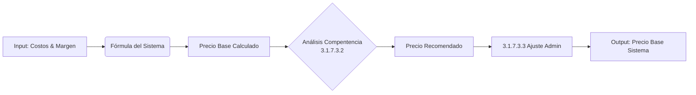

# 3.1.7.3 Recomendador de Precios

Sistema para sugerir precios óptimos.

---

## Objetivo

Calcular el precio mínimo viable y el precio recomendado para cada servicio.

> [!IMPORTANT]
> **Integración:** El precio calculado aquí es el **INPUT** para la [[Proyecto OnlyCarNLD/Datos/3.1.7.5 estrategia_precios_unificada]]. No es el precio final al cliente.

---

## Flujo de Cálculo

---

## Estructura de Hijos

| ID                                            | Nombre    | Descripción          | Estado |
| --------------------------------------------- | --------- | -------------------- | ------ |
| [[Proyecto OnlyCarNLD/Datos/3.1.7.3.1 algoritmo_sugerencia\|3.1.7.3.1]] | Algoritmo | Lógica de sugerencia | ✅      |
| [[Proyecto OnlyCarNLD/Datos/3.1.7.3.2 factores_mercado\|3.1.7.3.2]]     | Mercado   | Factores externos    | ✅      |
| [[Proyecto OnlyCarNLD/Datos/3.1.7.3.3 ajuste_admin\|3.1.7.3.3]]         | Ajuste    | Override manual      | ✅      |

---

## Navegación

| ⬆️ Padre             | [[Proyecto OnlyCarNLD/Datos/3.1.7 sistema_costos]]              |
| -------------------- | ------------------------------------- |
| ⬅️ Hermano anterior  | [[Proyecto OnlyCarNLD/Datos/3.1.7.2 margenes_ganancia]]         |
| ➡️ Hermano siguiente | [[Proyecto OnlyCarNLD/Datos/3.1.7.4 dashboard_rentabilidad]]    |

---
