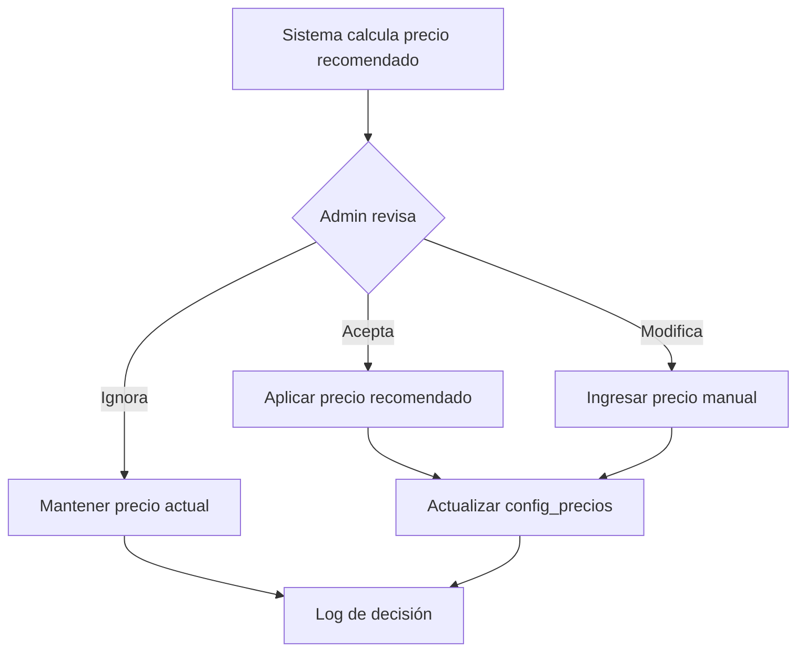

# 3.1.7.3.3 Ajuste por Admin

Interfaz para que el admin decida el precio final.

---

## Flujo de Decisión



---

## UI: Ajuste de Precios

```
┌─────────────────────────────────────────────────────────────────┐
│  💰 AJUSTAR PRECIO: LAVADO EXTERIOR BÁSICO                      │
├─────────────────────────────────────────────────────────────────┤
│                                                                 │
│  Precio actual:              $290                               │
│  Precio recomendado:         $340                               │
│  Diferencia:                 +$50 (+17.2%)                      │
│                                                                 │
│  ─── SIMULACIÓN ──────────────────────────────────────────────  │
│                                                                 │
│  Si aplicas $340:                                               │
│  ├── Margen OnlyCar:         10.8% 🟡                           │
│  ├── Comisión operador:      $227.80                            │
│  └── Impacto demanda:        -5% estimado                       │
│                                                                 │
│  ─── TU DECISIÓN ────────────────────────────────────────────   │
│                                                                 │
│  ○ Aplicar recomendado ($340)                                   │
│  ○ Precio personalizado: [ $320 ]                               │
│  ○ Mantener actual ($290)                                       │
│                                                                 │
│  Motivo: [ Transición gradual, subir en 2 fases ]               │
│                                                                 │
│  [ Cancelar ]                               [ Guardar cambio ]  │
│                                                                 │
└─────────────────────────────────────────────────────────────────┘
```

---

## Log de Cambios

```sql
CREATE TABLE precios_historial (
  id UUID PRIMARY KEY DEFAULT gen_random_uuid(),
  servicio_id VARCHAR(50) NOT NULL,
  precio_anterior DECIMAL(10,2) NOT NULL,
  precio_nuevo DECIMAL(10,2) NOT NULL,
  precio_recomendado DECIMAL(10,2),
  decision VARCHAR(20), -- 'aceptado', 'modificado', 'rechazado'
  motivo TEXT,
  admin_id UUID REFERENCES auth.users(id),
  created_at TIMESTAMPTZ DEFAULT now()
);
```

---

## Navegación

| ⬆️ Padre            | [[Proyecto OnlyCarNLD/Datos/3.1.7.3 recomendador_precios]] |
| ------------------- | -------------------------------- |
| ⬅️ Hermano anterior | [[Proyecto OnlyCarNLD/Datos/3.1.7.3.2 factores_mercado]]   |

---
