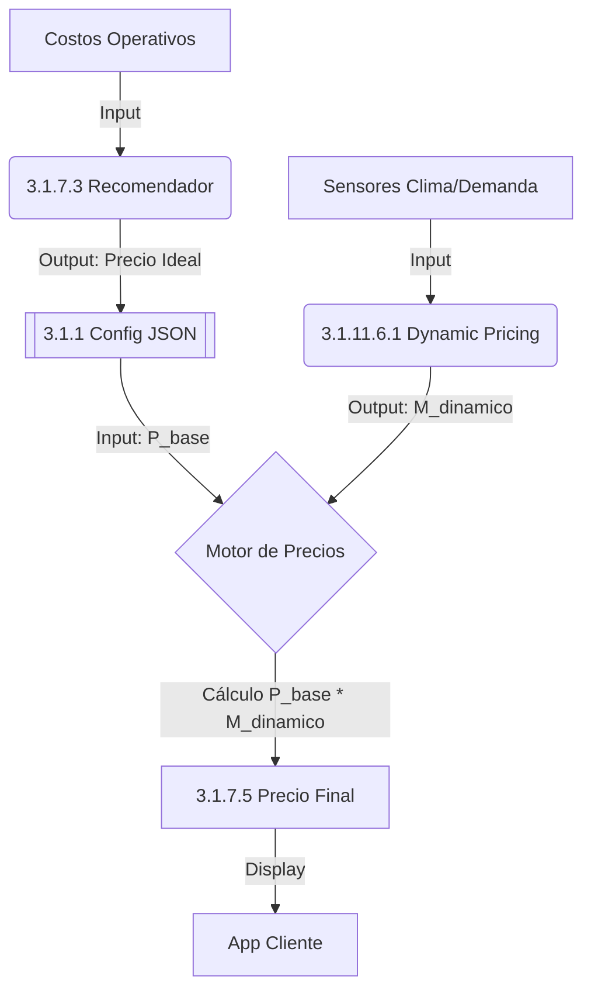

# 3.1.7.5 Estrategia de Precios Unificada

> **Propósito:** Unificar la lógica de "Precio Base" (Costos) y "Precio Dinámico" (Mercado) en una sola Fórmula Maestra.

---

## 1. La Fórmula Maestra

El precio final que ve el cliente se calcula en tiempo real siguiendo esta secuencia estricta:

$$
P_{final} = P_{base} \times M_{dinámico}
$$

Donde:

1.  **$P_{base}$ (Precio Base):** Calculado por [[Proyecto OnlyCarNLD/Datos/3.1.7.3 recomendador_precios]].
    *   Considera: Costos operativos, margen mínimo, impuestos.
    *   *Es estable y cambia poco (mensual/semanal).*

2.  **$M_{dinámico}$ (Multiplicador):** Calculado por [[Proyecto OnlyCarNLD/Datos/3.1.11.6.1 algoritmo_ajuste_precios]].
    *   Considera: Lluvia, alta demanda, escasez de operadores.
    *   *Es volátil y cambia cada 15 min.*
    *   Rango: `1.0x` a `2.0x`.

---

## 2. Flujo de Datos (Architecture Flow)

---

## 3. Gobernanza y Conflictos

¿Qué pasa si el algoritmo se vuelve loco?

1.  **Price Cap (Techo):** El sistema tiene un Hard Limit. El precio final NUNCA puede exceder `3.0x` del costo base, sin importar la demanda.
2.  **Admin Override:** El Administrador puede fijar manualmente un precio en [[Proyecto OnlyCarNLD/Datos/3.1.7.3.3 ajuste_admin]], lo cual fuerza $M_{dinámico} = 1.0$.

---

## Navegación

| ⬆️ Padre             | [[Proyecto OnlyCarNLD/Datos/3.1.7 sistema_costos]]              |
| -------------------- | ------------------------------------- |
| ⬅️ Hermano anterior  | [[Proyecto OnlyCarNLD/Datos/3.1.7.4 dashboard_rentabilidad]]    |
| ➡️ Hermano siguiente | [[Proyecto OnlyCarNLD/Datos/3.1.7.6 esquema_sql_costos]]        |

---
