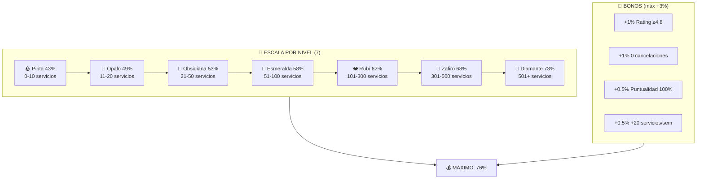
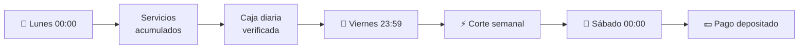

# 3.1.8 Sistema de Remuneración

Sistema integral de pago y compensación para operadores.

---

## Modelo Híbrido

```
┌─────────────────────────────────────────────────────────────────┐
│  COMISIÓN = ESCALA NIVEL + BONOS                                │
├─────────────────────────────────────────────────────────────────┤
│                                                                 │
│  ESCALA POR NIVEL (7 niveles):                                  │
│  ├── 🪨 Pirita       43%    (0-10 servicios)                    │
│  ├── 🌈 Ópalo        49%    (11-20 servicios)                   │
│  ├── 🖤 Obsidiana    53%    (21-50 servicios)                   │
│  ├── 💚 Esmeralda    58%    (51-100 servicios)                  │
│  ├── 🤍 Rubí         62%    (101-300 servicios)                 │
│  ├── 💙 Zafiro       68%    (301-500 servicios)                 │
│  └── 💎 Diamante     73%    (501+ servicios)                    │
│                                                                 │
│  BONOS ADICIONALES (máx +3%):                                   │
│  ├── +1.0%  Rating ≥4.8                                         │
│  ├── +1.0%  0 cancelaciones/mes                                 │
│  ├── +0.5%  Puntualidad 100%                                    │
│  └── +0.5%  +20 servicios/semana                                │
│                                                                 │
│  MÁXIMO POSIBLE: 76%                                            │
│                                                                 │
└─────────────────────────────────────────────────────────────────┘
```



---


## Ciclo de Pago

```
Lunes 00:00 ─────────────────────── Viernes 23:59
    │                                    │
    │  Servicios acumulados              │
    │  Caja diaria verificada            │
    │                                    │
    └────────────────────────────────────┼───► Corte semanal
                                         │
                                  Sábado 00:00
                                         │
                                         └───► Pago depositado
```



---


## Estructura de Hijos

| ID                                      | Nombre          | Descripción          | Nietos | Estado |
| --------------------------------------- | --------------- | -------------------- | ------ | ------ |
| [[Proyecto OnlyCarNLD/Datos/3.1.8.1 modelo_comision\|3.1.8.1]]    | Modelo Comisión | Estructura comisión  | 0 | ✅      |
| [[Proyecto OnlyCarNLD/Datos/3.1.8.2 pagos_operador\|3.1.8.2]]     | Pagos Operador  | Sistema de pagos     | 0 | ✅      |
| [[Proyecto OnlyCarNLD/Datos/3.1.8.3 simulador_operador\|3.1.8.3]] | Simulador       | Calculadora ingresos | 0 | ✅      |

---

## Navegación

| ⬆️ Padre             | [[Proyecto OnlyCarNLD/Datos/3.1. Logica_Negocio_Core]]             |
| -------------------- | ------------------------------ |
| ⬅️ Hermano anterior  | [[Proyecto OnlyCarNLD/Datos/3.1.7 sistema_costos]]       |
| ➡️ Hermano siguiente | [[Proyecto OnlyCarNLD/Datos/3.1.9 control_caja]]         |

---

