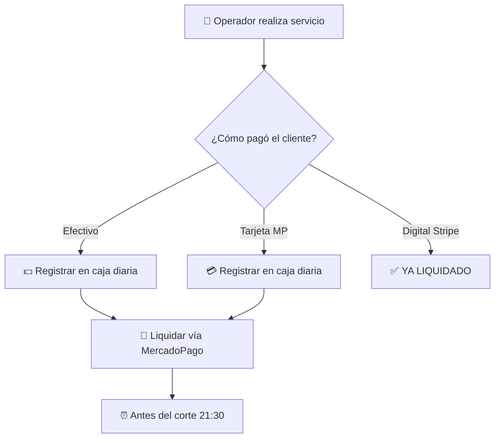

# 3.1.9 Control de Caja

Sistema de control financiero diario para operadores.

---

## Concepto Central

> [!IMPORTANT]
> **El operador cobra dinero que pertenece a OnlyCar.**
> Debe liquidar diariamente vía MercadoPago.

---

## ⚠️ DIFERENCIACIÓN DE HORARIOS

| Concepto | Horario | Frecuencia | Descripción |
|----------|---------|------------|-------------|
| **Corte de Caja** | 21:30 | DIARIO | Cierre de cobros del día |
| **Pago al Operador** | ~23:59 Viernes | SEMANAL | OnlyCar paga comisiones |

```
LUNES ─────────────────────────────────────────────── VIERNES
  │                                                      │
  ├─ 21:30 Corte caja lunes                              │
  ├─ 21:30 Corte caja martes                             │
  ├─ 21:30 Corte caja miércoles                          │
  ├─ 21:30 Corte caja jueves                             │
  └─ 21:30 Corte caja viernes                            │
                                                         │
                                            ~23:59 PAGO SEMANAL
                                                         │
                                                         ▼
                                            Sábado AM: Depósito vía
                                            Stripe Connect Express
```

```mermaid
gantt
    title Cortes de Caja Semanal
    dateFormat  YYYY-MM-DD
    section Lunes
    Corte 21:30  :milestone, m1, 2024-12-16, 0d
    section Martes
    Corte 21:30  :milestone, m2, 2024-12-17, 0d
    section Miércoles
    Corte 21:30  :milestone, m3, 2024-12-18, 0d
    section Jueves
    Corte 21:30  :milestone, m4, 2024-12-19, 0d
    section Viernes
    Corte 21:30  :milestone, m5, 2024-12-20, 0d
    Pago Semanal :milestone, crit, m6, 2024-12-20, 0d
    section Sábado
    Depósito AM  :milestone, done, m7, 2024-12-21, 0d
```

---

## Flujo General

```
┌─────────────────────────────────────────────────────────────────┐
│  OPERADOR REALIZA SERVICIO                                      │
├─────────────────────────────────────────────────────────────────┤
│                                                                 │
│  ¿Cómo pagó el cliente?                                         │
│                                                                 │
│  ┌──────────────┐  ┌──────────────┐  ┌──────────────────────┐   │
│  │   EFECTIVO   │  │ TARJETA MP   │  │   PAGO DIGITAL       │   │
│  │   (físico)   │  │ (terminal)   │  │   (Stripe link)      │   │
│  └──────┬───────┘  └──────┬───────┘  └──────────┬───────────┘   │
│         │                 │                     │               │
│         ▼                 ▼                     ▼               │
│   Registrar en      Registrar en          YA LIQUIDADO          │
│   caja diaria       caja diaria           (no aplica)           │
│         │                 │                                     │
│         └────────┬────────┘                                     │
│                  ▼                                              │
│         LIQUIDAR VÍA MERCADOPAGO                                │
│         antes del corte (21:30)                                 │
│                                                                 │
└─────────────────────────────────────────────────────────────────┘
```



---

## Proveedores de Pago

| Tipo | Proveedor | Uso |
|------|-----------|-----|
| **Digital** | Stripe | Pagos online del cliente |
| **Físico** | MercadoPago | Terminal operador + liquidación caja |

> [!NOTE]
> **Stripe** = Pagos DEL cliente (online)
> **MercadoPago** = Cobros físicos + liquidación caja

---

## Estructura de Hijos

| ID                                       | Nombre         | Descripción       | Nietos | Estado |
| ---------------------------------------- | -------------- | ----------------- | ------ | ------ |
| [[Proyecto OnlyCarNLD/Datos/3.1.9.1 caja_diaria\|3.1.9.1]]         | Caja Diaria    | Registro y cortes | 0 | ✅      |
| [[Proyecto OnlyCarNLD/Datos/3.1.9.2 depositos_efectivo\|3.1.9.2]]  | Liquidación Efectivo | Fondeo MP y pago | 0      | ✅      |
| [[Proyecto OnlyCarNLD/Datos/3.1.9.3 liquidacion_tarjeta\|3.1.9.3]] | Liquidación Tarjeta  | Cobros tarjeta    | 0 | ✅      |
| [[Proyecto OnlyCarNLD/Datos/3.1.9.4 penalizaciones_caja\|3.1.9.4]] | Penalizaciones | Sanciones caja    | 0 | ✅      |

---

## Integraciones

→ Ver MercadoPago: [[Proyecto OnlyCarNLD/Datos/5.11 mercadopago_integracion]]
→ Ver Stripe: [[Proyecto OnlyCarNLD/Datos/5.1. stripe_pagos]]
→ Ver pago al operador: [[Proyecto OnlyCarNLD/Datos/3.1.8.2 pagos_operador]]

---

## Navegación

| ⬆️ Padre             | [[Proyecto OnlyCarNLD/Datos/3.1. Logica_Negocio_Core]]               |
| -------------------- | -------------------------------- |
| ⬅️ Hermano anterior  | [[Proyecto OnlyCarNLD/Datos/3.1.8 sistema_remuneracion]]   |
| ➡️ Hermano siguiente | [[Proyecto OnlyCarNLD/Datos/3.1.10 sistema_financiamiento]]|

---
