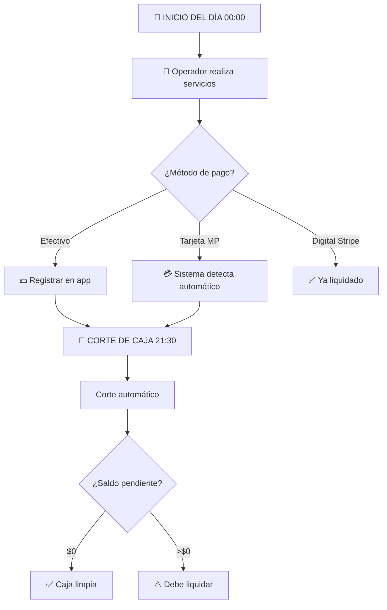

# 3.1.9.1 Caja Diaria

Sistema de registro y seguimiento de cobros diarios del operador.

---

## Propósito

Controlar el dinero que el operador cobra durante el día para:
- Saber cuánto debe depositar a OnlyCar
- Separar pagos en efectivo vs tarjeta
- Generar cortes diarios automáticos

---

## ⚠️ IMPORTANTE: Diferenciación de Horarios

> [!CAUTION]
> **No confundir estos dos conceptos:**
>
> | Concepto | Horario | Frecuencia |
> |----------|---------|------------|
> | **Corte de Caja** | 21:30 (9:30 PM) | DIARIO |
> | **Pago Semanal** | ~23:59 Viernes | SEMANAL |

### Corte de Caja Diario (21:30)
- Cierra la caja del día
- Operador tiene hasta este momento para liquidar
- Se genera resumen de lo cobrado

### Pago Semanal (~23:59 Viernes)
- OnlyCar paga al operador sus comisiones
- Hora simbólica (puede variar por procesamiento)
- Depósito puede llegar viernes noche o sábado AM

---

## Flujo del Día

```
INICIO DEL DÍA (00:00)
      │
      ▼
Operador realiza servicios
      │
      ├── Cliente paga EFECTIVO
      │   └── Operador registra en app → Liquidar vía MP Checkout
      │
      ├── Cliente paga TARJETA (Terminal MP del operador)
      │   └── Operador registra → Liquidar vía MP Checkout
      │
      └── Cliente paga DIGITAL (Stripe link)
          └── Ya liquidado (no aplica caja)
      │
      ▼
🔔 CORTE DE CAJA (21:30)
      │
      ▼
Corte automático → Saldo pendiente
      │
      ├── $0 pendiente → ✅ Caja limpia
      │
      └── >$0 pendiente → ⚠️ Debe liquidar
```



---


## Estados de la Caja

| Estado | Descripción | Acción requerida |
|--------|-------------|------------------|
| `abierta` | Día en curso (antes 21:30) | Ninguna |
| `cerrada` | Corte realizado (después 21:30) | Depositar si hay saldo |
| `liquidada` | Saldo $0 | Ninguna |
| `pendiente` | Saldo >$0 sin depositar | ⚠️ Urgente |

---

## Modelo de Datos

```sql
CREATE TABLE cajas_diarias (
  id UUID PRIMARY KEY DEFAULT gen_random_uuid(),
  operador_id UUID NOT NULL REFERENCES operadores(id),
  fecha DATE NOT NULL DEFAULT CURRENT_DATE,
  
  -- Totales del día
  total_efectivo DECIMAL(10,2) DEFAULT 0,
  total_tarjeta_mp DECIMAL(10,2) DEFAULT 0,  -- Terminal MercadoPago
  total_digital DECIMAL(10,2) DEFAULT 0,     -- Stripe (ya liquidado)
  
  -- Liquidaciones vía MercadoPago
  efectivo_liquidado DECIMAL(10,2) DEFAULT 0,
  tarjeta_liquidada DECIMAL(10,2) DEFAULT 0,
  
  -- Calculados
  saldo_efectivo DECIMAL(10,2) GENERATED ALWAYS AS 
    (total_efectivo - efectivo_liquidado) STORED,
  saldo_tarjeta DECIMAL(10,2) GENERATED ALWAYS AS 
    (total_tarjeta_mp - tarjeta_liquidada) STORED,
  saldo_total DECIMAL(10,2) GENERATED ALWAYS AS 
    (total_efectivo - efectivo_liquidado + total_tarjeta_mp - tarjeta_liquidada) STORED,
  
  estado VARCHAR(20) DEFAULT 'abierta',
  corte_at TIMESTAMPTZ,  -- 21:30 del día
  created_at TIMESTAMPTZ DEFAULT now(),
  
  UNIQUE(operador_id, fecha)
);

-- Índice para cron de corte diario
CREATE INDEX idx_cajas_fecha_estado ON cajas_diarias(fecha, estado);
```

---

## Cron de Corte Diario

```typescript
// Cron: Todos los días a las 21:30
const corteCajaDiario = async () => {
  const hoy = format(new Date(), 'yyyy-MM-dd');
  
  await supabase.from('cajas_diarias')
    .update({
      estado: 'cerrada',
      corte_at: new Date()
    })
    .eq('fecha', hoy)
    .eq('estado', 'abierta');
  
  // Notificar operadores con saldo pendiente
  const { data: pendientes } = await supabase
    .from('cajas_diarias')
    .select('operador_id, saldo_total')
    .eq('fecha', hoy)
    .gt('saldo_total', 0);
  
  for (const caja of pendientes) {
    await notifyOperador(caja.operador_id, {
      title: '⏰ Corte de caja realizado',
      body: `Tienes $${caja.saldo_total} pendiente. Liquida vía MercadoPago.`
    });
  }
};
```

---

## Estructura de Hijos

| ID                                       | Nombre | Descripción        | Estado |
| ---------------------------------------- | ------ | ------------------ | ------ |
| [[Proyecto OnlyCarNLD/Datos/3.1.9.1.1 registro_cobros\|3.1.9.1.1]] | Cobros | Registro de pagos  | ✅      |
| [[Proyecto OnlyCarNLD/Datos/3.1.9.1.2 tipos_pago\|3.1.9.1.2]]      | Tipos  | Efectivo/tarjeta   | ✅      |
| [[Proyecto OnlyCarNLD/Datos/3.1.9.1.3 corte_diario\|3.1.9.1.3]]    | Corte  | Cierre a las 21:30 | ✅      |

---

## Conexiones

| Módulo | Relación |
|--------|----------|
| [[Proyecto OnlyCarNLD/Datos/1.1.6 sistema_pagos]] | Pagos del CLIENTE |
| [[Proyecto OnlyCarNLD/Datos/3.1.8.2.1 corte_semanal]] | Pago AL OPERADOR (viernes) |
| [[Proyecto OnlyCarNLD/Datos/5.11 mercadopago_integracion]] | Liquidación de caja |

---

## Navegación

| ⬆️ Padre             | [[Proyecto OnlyCarNLD/Datos/3.1.9 control_caja]]            |
| -------------------- | --------------------------------- |
| ➡️ Hermano siguiente | [[Proyecto OnlyCarNLD/Datos/3.1.9.2 depositos_efectivo]]    |

---
