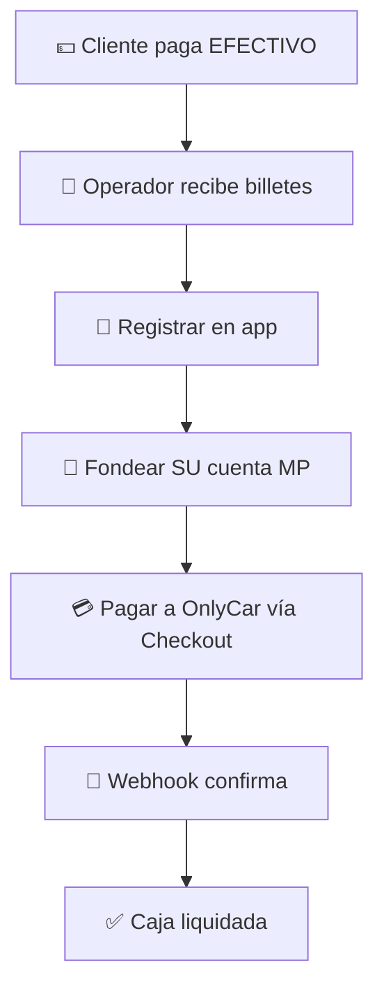
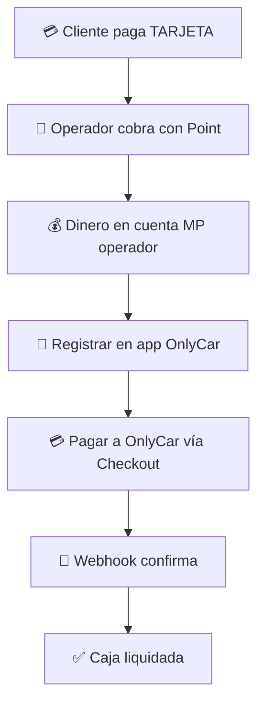

# 3.1.9.1.2 Tipos de Pago

Métodos de pago que recibe el operador.

---

## Tipos Soportados

| Tipo | Flujo de Liquidación |
|------|----------------------|
| 💵 Efectivo | Fondear cuenta MP propia → Pagar vía Checkout |
| 💳 Tarjeta Point | Ya en cuenta MP → Pagar vía Checkout |

---

## Efectivo



```
Cliente paga EFECTIVO
      │
      ▼
Operador recibe billetes
      │
      ▼
Registrar en app
      │
      ▼
Fondear SU cuenta MercadoPago
(Oxxo, Cajero, SPEI)
      │
      ▼
Pagar a OnlyCar vía Checkout
(usando Saldo MP)
      │
      ▼
Webhook confirma
      │
      ▼
Caja liquidada ✅
```

---

## Tarjeta (cobrado por operador)



```
Cliente paga con TARJETA
(Terminal Point del operador)
      │
      ▼
Dinero entra a cuenta MP del operador
      │
      ▼
Registrar cobro en app OnlyCar
      │
      ▼
Pagar a OnlyCar vía Checkout
(usando Saldo MP)
      │
      ▼
Webhook confirma
      │
      ▼
Caja liquidada ✅
```

---

## Navegación

| ⬆️ Padre             | [[Proyecto OnlyCarNLD/Datos/3.1.9.1 caja_diaria]]         |
| -------------------- | ------------------------------- |
| ⬅️ Hermano anterior  | [[Proyecto OnlyCarNLD/Datos/3.1.9.1.1 registro_cobros]]   |
| ➡️ Hermano siguiente | [[Proyecto OnlyCarNLD/Datos/3.1.9.1.3 corte_diario]]      |

---
