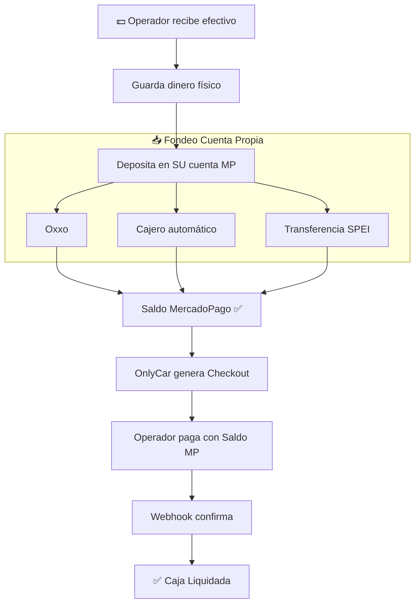

# 3.1.9.2 Liquidación de Efectivo

Sistema para que el operador liquide el efectivo que recibe de los clientes.

---

## Concepto Central

> [!IMPORTANT]
> El operador **NO deposita directamente a OnlyCar**.
> El operador fondea **SU PROPIA cuenta MercadoPago** y luego paga a OnlyCar.

---

## Flujo de Consolidación



---

## ¿Por qué este flujo?

| Método anterior (Obsoleto) | Método actual |
|---------------------------|---------------|
| Depositar a cuenta BBVA OnlyCar | Fondear cuenta propia MP |
| Código de referencia | Sin códigos |
| Conciliación manual | Webhook automático |
| Múltiples puntos de fallo | Ecosistema cerrado MercadoPago |

### Beneficios

1. **Ecosistema cerrado**: Todo dentro de MercadoPago
2. **Confirmación instantánea**: Webhook en tiempo real
3. **Sin conciliación manual**: Sistema automático
4. **Operador conserva control**: Usa su propia cuenta

---

## Flujo del Día (Ejemplo)

```
09:00 - Servicio #1: Cliente paga $500 efectivo
        Operador guarda billetes
        
12:00 - Servicio #2: Cliente paga $300 efectivo
        Operador guarda billetes
        
18:00 - Operador va a Oxxo
        Deposita $800 a SU cuenta MercadoPago
        
20:00 - App OnlyCar muestra: "Pendiente: $800"
        Operador presiona "Liquidar Caja"
        Sistema genera Checkout por $800
        
20:05 - Operador paga desde su Saldo MP
        Webhook confirma → Caja Liquidada ✅
        
21:30 - Corte de caja
        Estado: ✅ Liquidada
```

---

## Opciones de Fondeo (Cuenta Propia)

| Opción | Tiempo | Observación |
|--------|--------|-------------|
| **Oxxo/7-Eleven** | 15-30 min | Efectivo → Saldo MP |
| **Cajero automático** | Inmediato | Depósito con tarjeta |
| **SPEI** | Inmediato | Desde app bancaria |
| **Efectivo en tienda** | 1-2 horas | PayCash, etc. |

> [!TIP]
> El operador puede fondear en cualquier momento del día.
> Lo importante es tener saldo disponible antes del corte (21:30).

---

## UI: Liquidar Efectivo

```
┌─────────────────────────────────────────────────────────────────┐
│  💵 LIQUIDAR EFECTIVO                                           │
├─────────────────────────────────────────────────────────────────┤
│                                                                 │
│  Cobraste $800 en efectivo hoy                                  │
│                                                                 │
│  ┌─────────────────────────────────────────────────────────┐    │
│  │  #1  Lavado Express    │ 09:15 │ $500                   │    │
│  │  #2  Limpieza básica   │ 14:30 │ $300                   │    │
│  └─────────────────────────────────────────────────────────┘    │
│                                                                 │
│  Total a liquidar: $800 MXN                                     │
│                                                                 │
│  ─────────────────────────────────────────────────────────────  │
│                                                                 │
│  💡 Asegúrate de tener saldo en tu cuenta MercadoPago.          │
│     Puedes fondear en Oxxo, cajero o SPEI.                      │
│                                                                 │
│  [ 📱 Liquidar con MercadoPago ]                                │
│                                                                 │
│  ⏰ Corte de caja en 1h 30min (21:30)                           │
│                                                                 │
└─────────────────────────────────────────────────────────────────┘
```

---

## Implementación

→ Ver Checkout completo: [[Proyecto OnlyCarNLD/Datos/5.11.2 checkout_liquidacion]]
→ Ver Webhooks: [[Proyecto OnlyCarNLD/Datos/5.11.3 webhooks_mercadopago]]

---

## Navegación

| ⬆️ Padre             | [[Proyecto OnlyCarNLD/Datos/3.1.9 control_caja]]             |
| -------------------- | ---------------------------------- |
| ⬅️ Hermano anterior  | [[Proyecto OnlyCarNLD/Datos/3.1.9.1 caja_diaria]]            |
| ➡️ Hermano siguiente | [[Proyecto OnlyCarNLD/Datos/3.1.9.3 liquidacion_tarjeta]]    |

---
