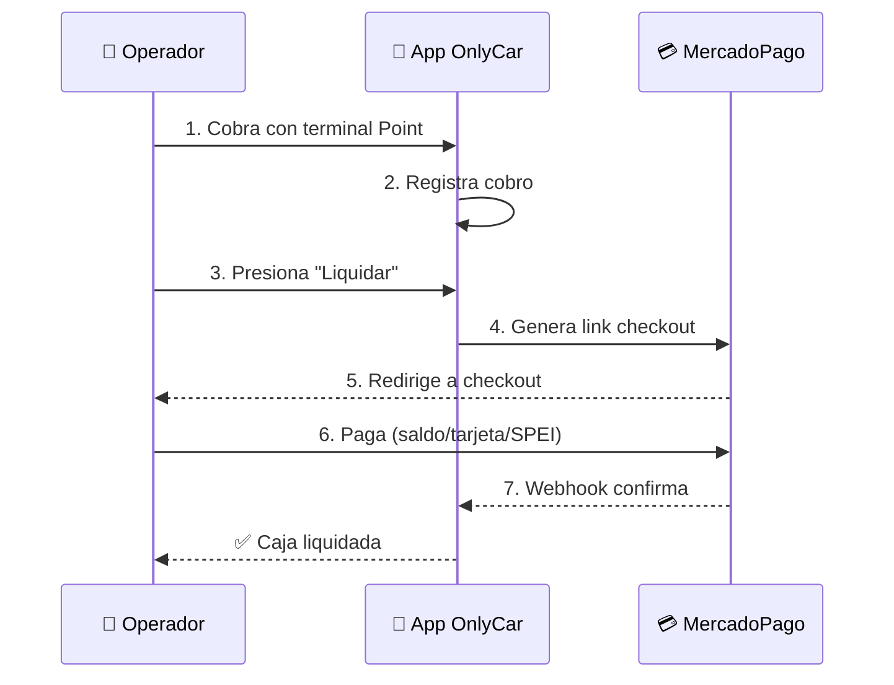

# 3.1.9.3 Liquidación por Tarjeta

Sistema para que el operador liquide cobros recibidos con tarjeta física.

---

## Contexto

> [!IMPORTANT]
> El operador usa **SU PROPIO** terminal MercadoPago Point.
> OnlyCar NO procesa esos cobros directamente.
> El operador debe **liquidar** lo cobrado a OnlyCar vía MercadoPago.

---

## Problema a Resolver

```
Cliente paga con tarjeta → Terminal MercadoPago del OPERADOR
                                    │
                                    ▼
                        Dinero en cuenta MP del operador
                                    │
                                    ▼
                        ¿Cómo llega a OnlyCar?
```

---

## Solución: MercadoPago Checkout

```
1. Operador cobra con su terminal Point
        │
        ▼
2. Sistema OnlyCar registra el cobro
   (operador confirma monto en app)
        │
        ▼
3. Antes del corte (21:30), operador tiene saldo pendiente
        │
        ▼
4. Operador presiona "Liquidar con MercadoPago"
        │
        ▼
5. Sistema genera link de pago (Checkout Pro)
        │
        ▼
6. Operador paga desde su cuenta MP (saldo, tarjeta, SPEI)
        │
        ▼
7. Webhook confirma → Caja liquidada ✅
```



---


## ⏰ Horario de Liquidación

> [!CAUTION]
> **Corte de caja diario: 21:30**
> 
> Liquidar ANTES de las 21:30 para caja limpia del día.
> Saldo no liquidado se acumula para el viernes.

---

## UI: Liquidar Cobros Tarjeta

```
┌─────────────────────────────────────────────────────────────────┐
│  💳 LIQUIDAR COBROS CON TARJETA                                 │
├─────────────────────────────────────────────────────────────────┤
│                                                                 │
│  Tienes $850 pendientes de cobros con tarjeta Point             │
│                                                                 │
│  ─── DETALLE ─────────────────────────────────────────────────  │
│                                                                 │
│  #1 Lavado Premium     │ $350  │ Point MP                       │
│  #2 Limpieza Interior  │ $500  │ Point MP                       │
│                                                                 │
│  ─────────────────────────────────────────────────────────────  │
│                                                                 │
│  Total a liquidar: $850 MXN                                     │
│                                                                 │
│  ─── MÉTODO RECOMENDADO ──────────────────────────────────────  │
│                                                                 │
│  [ 📱 Liquidar con MercadoPago ]                                │
│                                                                 │
│  💡 Usa tu saldo de MercadoPago para liquidar                   │
│     instantáneamente sin comisiones extras.                     │
│                                                                 │
│  ⏰ Tienes hasta las 21:30 para liquidar                        │
│                                                                 │
└─────────────────────────────────────────────────────────────────┘
```

---

## Implementación

```typescript
// server/api/caja/liquidar-tarjeta.post.ts
import { MercadoPagoConfig, Preference } from 'mercadopago';

const client = new MercadoPagoConfig({ 
  accessToken: process.env.MERCADOPAGO_ACCESS_TOKEN! 
});

export default defineEventHandler(async (event) => {
  const { operadorId, monto, cajaId } = await readBody(event);
  
  const preference = new Preference(client);
  
  const result = await preference.create({
    body: {
      items: [{
        id: `liquidacion-tarjeta-${cajaId}`,
        title: 'Liquidación cobros tarjeta OnlyCar',
        quantity: 1,
        unit_price: monto,
        currency_id: 'MXN'
      }],
      external_reference: JSON.stringify({
        type: 'liquidacion_tarjeta',
        operador_id: operadorId,
        caja_id: cajaId,
        monto: monto
      }),
      notification_url: `${process.env.APP_URL}/api/webhooks/mercadopago`,
      auto_return: 'approved'
    }
  });
  
  return { checkout_url: result.init_point };
});
```

---

## Modelo de Datos

```sql
CREATE TABLE liquidaciones_tarjeta (
  id UUID PRIMARY KEY DEFAULT gen_random_uuid(),
  operador_id UUID NOT NULL REFERENCES operadores(id),
  caja_id UUID NOT NULL REFERENCES cajas_diarias(id),
  
  monto DECIMAL(10,2) NOT NULL,
  metodo VARCHAR(20) DEFAULT 'mercadopago',
  
  -- MercadoPago
  preference_id VARCHAR(50),
  payment_id VARCHAR(50),
  
  -- Estado
  estado VARCHAR(20) DEFAULT 'pendiente',
  -- pendiente, procesando, completado, fallido
  
  completado_at TIMESTAMPTZ,
  created_at TIMESTAMPTZ DEFAULT now()
);
```

---

## Integración con MercadoPago

→ Ver Point Terminal: [[Proyecto OnlyCarNLD/Datos/5.11.1 point_terminal]]
→ Ver Checkout: [[Proyecto OnlyCarNLD/Datos/5.11.2 checkout_liquidacion]]
→ Ver Webhooks: [[Proyecto OnlyCarNLD/Datos/5.11.3 webhooks_mercadopago]]

---

## Navegación

| ⬆️ Padre             | [[Proyecto OnlyCarNLD/Datos/3.1.9 control_caja]]           |
| -------------------- | -------------------------------- |
| ⬅️ Hermano anterior  | [[Proyecto OnlyCarNLD/Datos/3.1.9.2 depositos_efectivo]]   |
| ➡️ Hermano siguiente | [[Proyecto OnlyCarNLD/Datos/3.1.9.4 penalizaciones_caja]]  |

---
