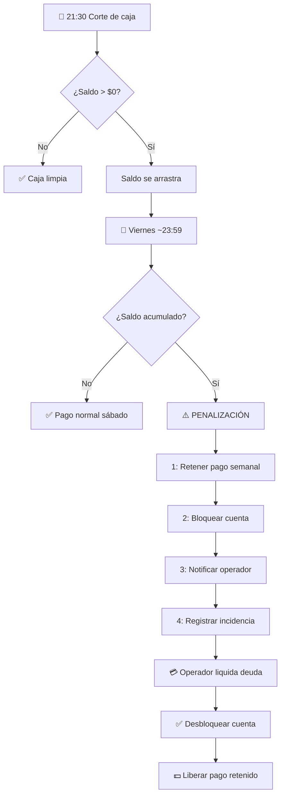

# 3.1.9.4 Penalizaciones de Caja

Sistema de consecuencias por caja no liquidada.

---

## Filosofía

> [!CAUTION]
> El operador que no liquida su caja **retiene dinero de OnlyCar**.
> Esto es inaceptable y tiene consecuencias inmediatas.

---

## ⚠️ RECORDATORIO DE HORARIOS

| Concepto | Horario | Consecuencia |
|----------|---------|--------------|
| **Corte Caja Diario** | 21:30 | Caja se cierra, saldo queda pendiente |
| **Corte Semanal** | Viernes ~23:59 | Se evalúa deuda acumulada |

---

## Política de Retención

**Si el operador tiene saldo pendiente al viernes ~23:59:**

| Consecuencia | Efecto |
|--------------|--------|
| Pago semanal **RETENIDO** | No recibe su comisión |
| Cuenta **BLOQUEADA** | No puede aceptar nuevos servicios |
| Deuda **ACUMULADA** | Se suma a la siguiente semana |
| Penalización administrativa | Registro en historial |

---

## Flujo de Penalización

```
DIARIO 21:30 - Corte de caja
        │
        ▼
Si saldo > $0:
├── Notificación: "Liquida tu caja"
└── Saldo se arrastra al siguiente día
        │
        ▼
VIERNES ~23:59 - Corte semanal
        │
        ▼
Sistema verifica: ¿Operador tiene saldo ACUMULADO pendiente?
        │
        ├── NO → Pago normal el sábado ✅
        │
        └── SÍ → Activar penalización
                    │
                    ▼
            ┌───────────────────────────┐
            │ 1. Retener pago semanal   │
            │ 2. Bloquear cuenta        │
            │ 3. Notificar operador     │
            │ 4. Registrar incidencia   │
            └───────────────────────────┘
                    │
                    ▼
            Operador liquida deuda vía MercadoPago
                    │
                    ▼
            ┌───────────────────────────┐
            │ 1. Desbloquear cuenta     │
            │ 2. Liberar pago retenido  │
            │ 3. Limpiar historial      │
            └───────────────────────────┘
```



---


## Notificaciones de Alerta

### Alertas Diarias (después del corte 21:30)

| Momento | Canal | Mensaje |
|---------|-------|---------|
| 21:35 | Push | "⏰ Corte de caja. Tienes $X pendiente" |
| 22:30 | Push | "💰 Recuerda liquidar tu caja vía MercadoPago" |

### Alertas Semanales (viernes)

| Momento | Canal | Mensaje |
|---------|-------|---------|
| Viernes 18:00 | Push + Email | "⚠️ Tienes $X acumulado esta semana. Liquida antes de tu pago" |
| Viernes 21:00 | Push urgente | "🚨 ÚLTIMA HORA: Liquida o se retiene tu pago" |
| Sábado 00:05 | Push + Email | "🔴 Tu pago está retenido. Liquida para liberarlo" |

---

## Modelo de Datos

```sql
CREATE TABLE penalizaciones_caja (
  id UUID PRIMARY KEY DEFAULT gen_random_uuid(),
  operador_id UUID NOT NULL REFERENCES operadores(id),
  semana_inicio DATE NOT NULL,  -- Lunes de la semana
  
  monto_deuda_acumulada DECIMAL(10,2) NOT NULL,
  pago_retenido_id UUID REFERENCES pagos_operador(id),
  
  estado VARCHAR(20) DEFAULT 'activa',
  -- activa, resuelta, condonada
  
  resuelto_at TIMESTAMPTZ,
  metodo_resolucion VARCHAR(50),  -- 'mercadopago', 'admin_manual'
  
  created_at TIMESTAMPTZ DEFAULT now()
);

-- Bloqueo de cuenta
CREATE TABLE bloqueos_operador (
  id UUID PRIMARY KEY DEFAULT gen_random_uuid(),
  operador_id UUID NOT NULL REFERENCES operadores(id),
  motivo VARCHAR(50) NOT NULL, -- 'caja_pendiente', 'verificacion'
  penalizacion_id UUID REFERENCES penalizaciones_caja(id),
  
  activo BOOLEAN DEFAULT true,
  created_at TIMESTAMPTZ DEFAULT now(),
  resuelto_at TIMESTAMPTZ
);
```

---

## Estructura de Hijos

| ID                                            | Nombre       | Descripción        | Estado |
| --------------------------------------------- | ------------ | ------------------ | ------ |
| [[Proyecto OnlyCarNLD/Datos/3.1.9.4.1 deuda_pendiente\|3.1.9.4.1]]      | Deuda        | Saldo adeudado     | ✅      |
| [[Proyecto OnlyCarNLD/Datos/3.1.9.4.2 bloqueo_servicios\|3.1.9.4.2]]    | Bloqueo      | Restricción cuenta | ✅      |
| [[Proyecto OnlyCarNLD/Datos/3.1.9.4.3 proceso_recuperacion\|3.1.9.4.3]] | Recuperación | Resolver deuda     | ✅      |

---

## Navegación

| ⬆️ Padre            | [[Proyecto OnlyCarNLD/Datos/3.1.9 control_caja]]           |
| ------------------- | -------------------------------- |
| ⬅️ Hermano anterior | [[Proyecto OnlyCarNLD/Datos/3.1.9.3 liquidacion_tarjeta]]  |

→ Ver liquidación vía MercadoPago: [[Proyecto OnlyCarNLD/Datos/5.11 mercadopago_integracion]]

---
