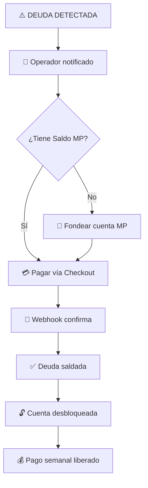

# 3.1.9.4.3 Proceso de Recuperación

Cómo el operador resuelve la deuda.

---

## Flujo de Recuperación

```
DEUDA DETECTADA
      │
      ▼
Operador notificado
      │
      ▼
Liquidar vía MercadoPago Checkout:
│
├── Si tiene efectivo → Fondear cuenta MP primero
└── Si tiene Saldo MP → Pagar directo
      │
      ▼
Sistema verifica pago (Webhook)
      │
      ▼
Deuda saldada ✅
      │
      ▼
Cuenta desbloqueada
Pago semanal liberado
```



---


## Reactivación Automática

```typescript
// Trigger: Al verificarse depósito o pago
const reactivarCuenta = async (operadorId: string) => {
  // Verificar si ya no hay deuda
  const { count } = await supabase
    .from('deudas_caja')
    .select('*', { count: 'exact' })
    .eq('operador_id', operadorId)
    .eq('estado', 'activa');
  
  if (count === 0) {
    // Desbloquear cuenta
    await supabase
      .from('operadores')
      .update({ estado: 'activo' })
      .eq('id', operadorId);
    
    // Liberar pago retenido
    await supabase
      .from('pagos_operador')
      .update({ estado: 'pendiente', motivo: null })
      .eq('operador_id', operadorId)
      .eq('estado', 'retenido');
    
    // Notificar
    await notifyOperador(operadorId, {
      title: '✅ ¡Cuenta reactivada!',
      body: 'Tu caja está al día. Ya puedes recibir servicios.'
    });
  }
};
```

---

## UI: Cuenta Reactivada

```
┌─────────────────────────────────────────────────────────────────┐
│  ✅ ¡CUENTA REACTIVADA!                                         │
├─────────────────────────────────────────────────────────────────┤
│                                                                 │
│  Tu caja está al día.                                           │
│                                                                 │
│  Ahora puedes:                                                  │
│  ✅ Aceptar nuevos servicios                                    │
│  ✅ Recibir tu pago semanal                                     │
│                                                                 │
│  Tu pago retenido de $2,188.92 será procesado                   │
│  en el próximo corte (viernes 23:59).                           │
│                                                                 │
│  [ Ver servicios disponibles ]                                  │
│                                                                 │
└─────────────────────────────────────────────────────────────────┘
```

---

## Navegación

| ⬆️ Padre            | [[Proyecto OnlyCarNLD/Datos/3.1.9.4 penalizaciones_caja]]   |
| ------------------- | --------------------------------- |
| ⬅️ Hermano anterior | [[Proyecto OnlyCarNLD/Datos/3.1.9.4.2 bloqueo_servicios]]   |

---
