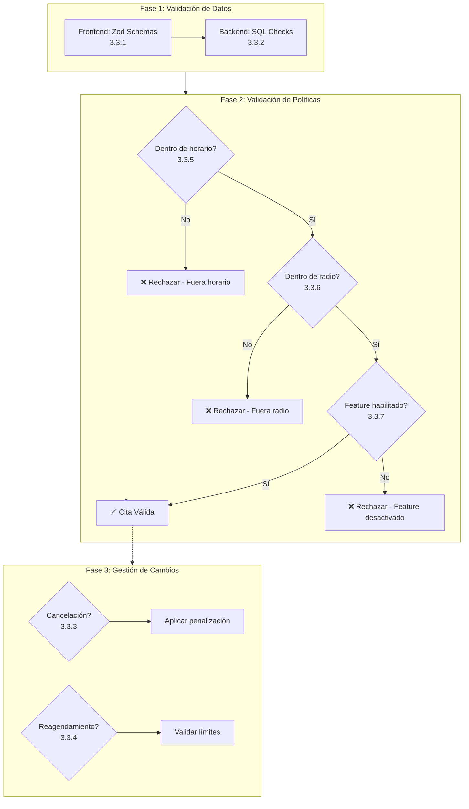

# 3.3 Reglas de Negocio

> Horarios, radio, cancelaciones, etc.

---

## Flujo General de Validación de Cita

---

## Horarios de Servicio

| Parámetro           | Valor                           |
| ------------------- | ------------------------------- |
| **Días laborables** | Lunes - Sábado                  |
| **Horario**         | 7:00 AM - 9:00 PM               |
| **Festivos**        | Configurables por Admin         |
| **Domingos**        | Solo servicios B2B con contrato |

---

## Radio de Servicio

| Zona                 | Radio              | Notas          |
| -------------------- | ------------------ | -------------- |
| **Nuevo Laredo**     | 20 km desde centro | Área principal |
| **Expansión futura** | Configurable       | Por ciudad     |

---

## Políticas de Cancelación

| Tiempo antes del servicio | Penalización |
|---------------------------|--------------|
| > 24 horas | Sin cargo |
| 12-24 horas | 25% del servicio |
| < 12 horas | 50% del servicio |
| No-show | 100% del servicio |

---

## Restricciones Operativas

| Regla                     | Descripción                   |
| ------------------------- | ----------------------------- |
| **Servicios simultáneos** | Máx 1 por operador            |
| **Capacidad diaria**      | Máx 20 servicios por operador |
| **Descanso mínimo**       | 30 min entre servicios        |
| **Re-agendamiento**       | Máx 2 veces por cliente       |

---

## Estructura de Hijos (Deep Dive)

| ID                                           | Nombre                   | Descripción             | Nietos | Estado |
| -------------------------------------------- | ------------------------ | ----------------------- | ------ | ------ |
| [[Proyecto OnlyCarNLD/Datos/3.3.1 Validaciones_Frontend\|3.3.1]]       | Validaciones Frontend    | Zod, masks, formularios | 0 | ✅      |
| [[Proyecto OnlyCarNLD/Datos/3.3.2 Validaciones_Backend\|3.3.2]]        | Validaciones Backend     | Checks SQL, triggers    | 0      | ✅      |
| [[Proyecto OnlyCarNLD/Datos/3.3.3 Politicas_Cancelacion\|3.3.3]]       | Políticas Cancelación    | Tarifas dinámicas       | 0      | ✅      |
| [[Proyecto OnlyCarNLD/Datos/3.3.4 Politicas_Reagendamiento\|3.3.4]]    | Políticas Reagendamiento | Límites, excepciones    | 0      | ✅      |
| [[Proyecto OnlyCarNLD/Datos/3.3.5 Horarios_Disponibilidad\|3.3.5]]     | Horarios Disponibilidad  | Franjas, festivos       | 0      | ✅      |
| [[Proyecto OnlyCarNLD/Datos/3.3.6 Radio_Servicio\|3.3.6]]              | Radio Servicio           | Geofencing, ciudades    | 0      | ✅      |
| [[Proyecto OnlyCarNLD/Datos/3.3.7 Feature_Flags\|3.3.7]]               | Feature Flags            | Activación dinámica     | 0      | ✅      |

---

## Navegación

| ⬆️ Padre             | [[Proyecto OnlyCarNLD/Datos/3.0. datos_y_logica]]          |
| -------------------- | -------------------------------- |
| ⬅️ Hermano anterior  | [[Proyecto OnlyCarNLD/Datos/3.2. matriz_permisos]]         |
| ➡️ Hermano siguiente | [[Proyecto OnlyCarNLD/Datos/3.4. Administracion_DB]]       |

---
