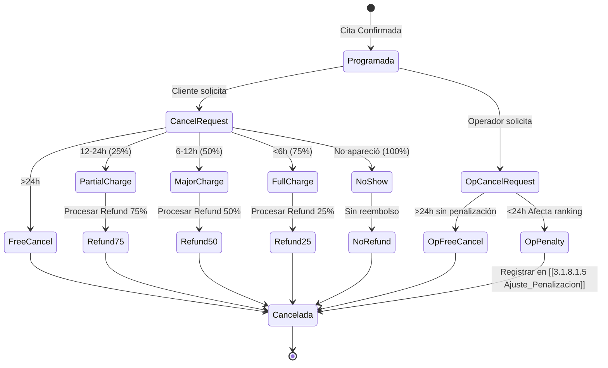

# 3.3.3 Políticas de Cancelación

> Tarifas dinámicas según anticipación de la cancelación.

---

## 1. Tabla de Penalizaciones

| Anticipación | Penalización | Reembolso Cliente |
|--------------|--------------|-------------------|
| > 24 horas | 0% (gratis) | 100% |
| 12-24 horas | 25% | 75% |
| 6-12 horas | 50% | 50% |
| < 6 horas | 75% | 25% |
| No-show | 100% | 0% |

---

## 2. Diagrama de Estado de Cancelación



---

## 3. Lógica de Excepciones

Casos donde se omite la penalización estándar:

| Excepción | Penalización | Aprobador | Evidencia Requerida |
|-----------|--------------|-----------|---------------------|
| Emergencia médica documentada | 0% | Admin | Documento médico |
| Clima severo (huracán/inundación) | 0% automático | Sistema | Alerta meteorológica |
| Muerte familiar | 0% + cupón APOLOGY | Admin | Acta defunción |
| Falla del operador | 0% + bonificación cliente | Sistema | Log de incidencia |
| Error de sistema | 0% + bonificación | Sistema | Log de error |

---

## 4. Integración API

**Endpoint:** `PATCH /api/citas/:id/cancel`

```typescript
// Request
interface CancelCitaRequest {
  motivo: 'CLIENTE' | 'OPERADOR' | 'SISTEMA' | 'EXCEPCION';
  razon?: string;
  solicita_excepcion?: boolean;
  evidencia_url?: string;
}

// Response (200 OK)
interface CancelCitaResponse {
  cita_id: string;
  estado: 'cancelada';
  penalizacion_aplicada: number;
  refund_procesado: boolean;
  refund_monto?: number;
}
```

**Referencia Completa:** [[Proyecto OnlyCarNLD/Datos/3.1.5 api_logica_negocio]]

---

## 5. Lógica de Cálculo

```typescript
const calcularPenalizacion = (cita: Cita): number => {
  const horasAntes = differenceInHours(cita.fecha_programada, new Date());
  
  if (horasAntes > 24) return 0;
  if (horasAntes >= 12) return cita.precio_final * 0.25;
  if (horasAntes >= 6) return cita.precio_final * 0.50;
  if (horasAntes > 0) return cita.precio_final * 0.75;
  return cita.precio_final; // No-show
};
```

---

## Navegación

| ⬆️ Padre | [[Proyecto OnlyCarNLD/Datos/3.3. reglas_negocio]] |
|----------|-------------------------|
| ⬅️ Anterior | [[Proyecto OnlyCarNLD/Datos/3.3.2 Validaciones_Backend]] |
| ➡️ Siguiente | [[Proyecto OnlyCarNLD/Datos/3.3.4 Politicas_Reagendamiento]] |
| 🔗 Relacionado | [[Proyecto OnlyCarNLD/Datos/1.6.3.3 politicas_compensacion]] |
| 🔗 Relacionado | [[Proyecto OnlyCarNLD/Datos/5.1. stripe_pagos]] |

---

