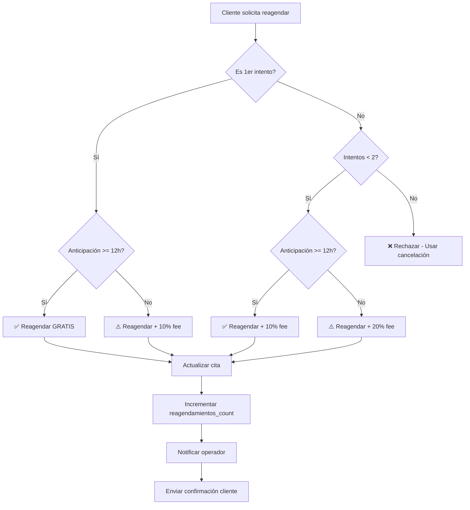

# 3.3.4 Políticas de Reagendamiento

> Límites y excepciones para cambios de fecha.

---

## 1. Reglas Básicas

| Regla | Valor |
|-------|-------|
| Reagendamientos gratis | 1 por cita |
| Penalización adicional | 10% por cada siguiente |
| Anticipación mínima | 12 horas |
| Máximo reagendamientos | 2 por cita |
| Excepciones | Clima, emergencia, operador |

---

## 2. Diagrama de Flujo



---

## 3. Lógica de Excepciones

| Caso | Acción | Límite | Aprobador |
|------|--------|--------|-----------|
| Cliente B2B Corporativo | Ilimitado gratis | Sin límite | Automático |
| Operador no disponible | Reagendar sin límite | Sin límite | Sistema |
| Clima severo | Reagendar sin límite | Sin límite | Admin |
| Emergencia médica | +1 reagendamiento gratis | 3 total | Admin |
| Error de sistema | Sin penalización | Sin límite | Sistema |

---

## 4. Modelo de Datos

```sql
-- Ya existe en tabla citas, validar columnas:
ALTER TABLE citas 
ADD COLUMN IF NOT EXISTS reagendamientos_count INTEGER DEFAULT 0;

ALTER TABLE citas 
ADD COLUMN IF NOT EXISTS reagendamiento_fee_total DECIMAL(10,2) DEFAULT 0;

-- Historial de reagendamientos
CREATE TABLE IF NOT EXISTS cita_reagendamientos (
  id UUID PRIMARY KEY DEFAULT gen_random_uuid(),
  cita_id UUID REFERENCES citas(id) ON DELETE CASCADE,
  
  fecha_original TIMESTAMPTZ NOT NULL,
  fecha_nueva TIMESTAMPTZ NOT NULL,
  
  motivo VARCHAR(50), -- 'CLIENTE', 'OPERADOR', 'SISTEMA', 'EXCEPCION'
  fee_aplicado DECIMAL(10,2) DEFAULT 0,
  
  created_at TIMESTAMPTZ DEFAULT NOW()
);
```

---

## 5. Integración API

**Endpoint:** `PATCH /api/citas/:id/reagendar`

```typescript
interface ReagendarRequest {
  nueva_fecha: string; // ISO 8601
  motivo?: string;
  solicita_excepcion?: boolean;
}

interface ReagendarResponse {
  cita_id: string;
  fecha_anterior: string;
  fecha_nueva: string;
  fee_aplicado: number;
  reagendamientos_restantes: number;
}
```

---

## Navegación

| ⬆️ Padre | [[Proyecto OnlyCarNLD/Datos/3.3. reglas_negocio]] |
|----------|-------------------------|
| ⬅️ Anterior | [[Proyecto OnlyCarNLD/Datos/3.3.3 Politicas_Cancelacion]] |
| ➡️ Siguiente | [[Proyecto OnlyCarNLD/Datos/3.3.5 Horarios_Disponibilidad]] |
| 🔗 Relacionado | [[Proyecto OnlyCarNLD/Datos/1.3.6.1 asignacion_citas]] |

---

