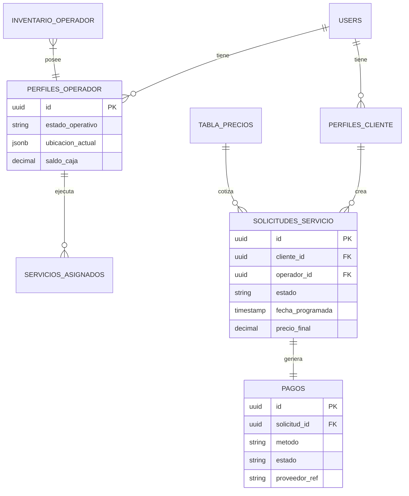

# 3.4.6 Modelo ER Global

> **Fuente de Verdad:** Este diagrama es una representación visual. La definición estricta de tablas está en [[Proyecto OnlyCarNLD/Datos/3.1.4 esquema_sql_logica_negocio]].

---

## Diagrama Maestro

---

## Navegación

| ⬆️ Padre             | [[Proyecto OnlyCarNLD/Datos/3.4. Administracion_DB]] |
| -------------------- | -------------------------- |
| ⬅️ Hermano anterior  | [[Proyecto OnlyCarNLD/Datos/3.4.5 Versionado_Esquema]] |
| ➡️ Hermano siguiente | -                          |

---
