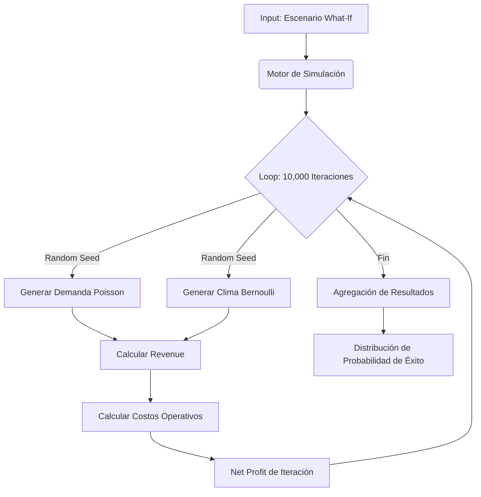

# 3.5 Simulación Financiera (El Oráculo)

> **Rol:** El Oráculo del Negocio.
> **Propósito:** Responder preguntas "What-If" complejas mediante modelos estocásticos.

---

## Metodología de Simulación

Utilizamos un enfoque híbrido:

### 1. Variables Deterministas (Constantes)
Costo de insumos, tarifas de Stripe, comisiones fijas.

### 2. Variables Estocásticas (Incertidumbre)
Modelamos la realidad usando distribuciones de probabilidad:

*   **Demanda de Servicios:** Modelada como un proceso de Poisson no homogéneo.
    $$ P(k \text{ eventos en intervalo } t) = \frac{\lambda^k e^{-\lambda}}{k!} $$
    Donde $\lambda$ varía según hora del día y día de la semana.

*   **Clima (Lluvia):** Distribución de Bernoulli.
    $$ P(\text{Lluvia}) = p, \quad P(\text{Seco}) = 1-p $$
    Donde $p$ se obtiene de la API histórica de OpenWeatherMap.

*   **Eficiencia Operador:** Distribución Normal.
    $$ T_{servicio} \sim N(\mu=45\text{min}, \sigma=10\text{min}) $$

---

## Flujo de Simulación (Monte Carlo Engine)

---

## Estructura de Hijos

| ID                                       | Nombre      | Descripción                      | Estado |
| ---------------------------------------- | ----------- | -------------------------------- | ------ |
| [[Proyecto OnlyCarNLD/Datos/3.5.1 escenarios_montecarlo\|3.5.1]]   | Monte Carlo | Proyecciones probabilísticas     | ✅      |
| [[Proyecto OnlyCarNLD/Datos/3.5.2 analisis_breakeven\|3.5.2]]      | Break-even  | Punto de equilibrio dinámico     | ✅      |
| [[Proyecto OnlyCarNLD/Datos/3.5.3 stress_test_financiero\|3.5.3]]  | Stress Test | Resiliencia ante "Cisnes Negros" | ✅      |

---

## Navegación

| ⬆️ Padre | [[Proyecto OnlyCarNLD/Datos/3.0. datos_y_logica]] |
|----------|-------------------------|
| ⬅️ Hermano | [[Proyecto OnlyCarNLD/Datos/3.4. Administracion_DB]] |
| ➡️ Hermano | [[Proyecto OnlyCarNLD/Datos/3.6. Auditoria_Logica]] |

---
