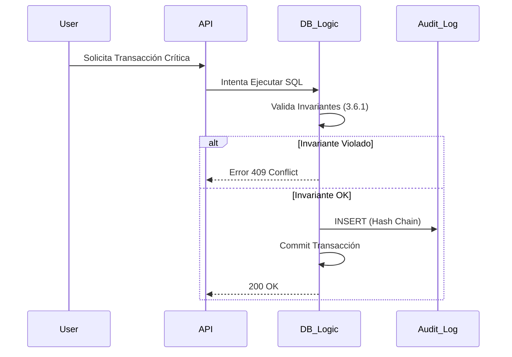

# 3.6 Auditoría Lógica

> **Rol:** El Juez Inmutable del Sistema.
> **Propósito:** Garantizar que ninguna transacción viole las reglas fundamentales, usando criptografía y bloqueos a nivel de base de datos.

---

## Arquitectura de Inmutabilidad

Para garantizar el principio de **"Verdad Única"**, implementamos las siguientes barreras técnicas:

### 1. Tablas Append-Only (WORM)
La tabla `audit_logs` está configurada para **SOLO permitir INSERT**.
*   **UPDATE:** Bloqueado por Trigger `BEFORE UPDATE RAISE EXCEPTION`.
*   **DELETE:** Bloqueado por Trigger `BEFORE DELETE RAISE EXCEPTION`.
*   **TRUNCATE:** Revocado a nivel de rol de base de datos.

### 2. Cadena de Custodia (Hash Chain)
Cada registro de auditoría contiene un hash criptográfico que incluye el hash del registro anterior.
$$ Hash_n = SHA256(Data_n + Hash_{n-1}) $$
*Esto hace matemáticamente imposible alterar un registro histórico sin romper toda la cadena posterior.*

### 3. RLS de Nivel Superior
Incluso el usuario `admin` del dashboard NO tiene permisos de escritura en las tablas de auditoría. Solo el rol `postgres` (sistema) o funciones definidas con `SECURITY DEFINER` pueden escribir.

---

## Flujo de Validación

---

## Estructura de Hijos

| ID                                        | Nombre       | Descripción                          | Estado |
| ----------------------------------------- | ------------ | ------------------------------------ | ------ |
| [[Proyecto OnlyCarNLD/Datos/3.6.1 invariantes_sistema\|3.6.1]]      | Invariantes  | Reglas absolutas inquebrantables     | ✅      |
| [[Proyecto OnlyCarNLD/Datos/3.6.2 deteccion_anomalias\|3.6.2]]      | Detección    | Watchdogs y heurísticas de fraude    | ✅      |
| [[Proyecto OnlyCarNLD/Datos/3.6.3 trazabilidad_decisiones\|3.6.3]]  | Trazabilidad | Caja negra de decisiones automáticas | ✅      |

---

## Navegación

| ⬆️ Padre | [[Proyecto OnlyCarNLD/Datos/3.0. datos_y_logica]] |
|----------|-------------------------|
| ⬅️ Hermano | [[Proyecto OnlyCarNLD/Datos/3.5. Simulacion_Financiera]] |
| ➡️ Hermano | [[Proyecto OnlyCarNLD/Datos/4.0. necesidades_del_sistema]] |

---
