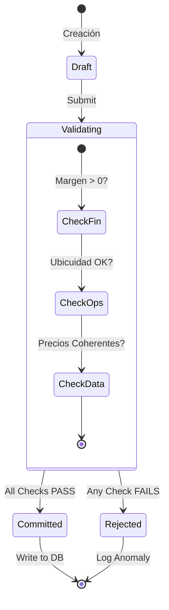

# 3.6.1 Invariantes del Sistema

> **Objetivo:** Definir las "Leyes de la Física" del negocio OnlyCar.

---

## Invariantes Financieros

1.  **Margen Positivo:** `(Precio - Costo Total)` SIEMPRE debe ser > 0.
2.  **Suma Zero Caja:** `(Efectivo Recaudado - Liquidaciones) == Saldo en Caja`.
3.  **No-Deuda Operativa:** Un operador no puede recibir servicios si su deuda > Límite Fianza.
4.  **Comisión Mínima:** La comisión del operador nunca puede ser inferior al Salario Mínimo por hora equivalente.

---

## Invariantes Operativos

1.  **Ubicuidad Exclusiva:** Un operador NO puede estar en estado `EnServicio` en dos citas simultáneas.
2.  **Tiempo Físico:** La duración real de un servicio no puede ser < 50% del tiempo estimado estándar (flag de fraude).
3.  **Stock No-Negativo:** El inventario virtual nunca puede ser < 0.

### Ciclo de Vida de Transacción Segura

---

## Invariantes de Datos

1.  **Integridad de Precio:** El precio final cobrado debe coincidir con `(Precio Base + Adicionales - Descuentos)`.
2.  **Inmutabilidad Histórica:** Una cita en estado `Completada` no puede modificar sus montos financieros.

---

## Navegación

| ⬆️ Padre | [[Proyecto OnlyCarNLD/Datos/3.6. Auditoria_Logica]] |
|----------|---------------------------|
| ⬅️ Hermano | NO |
| ➡️ Hermano | [[Proyecto OnlyCarNLD/Datos/3.6.2 deteccion_anomalias]] |

---
