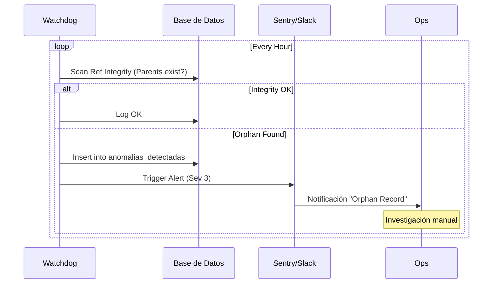

# 3.6.2 Detección de Anomalías

> **Misión:** Identificar "humo" antes de que haya "fuego". Monitoreo proactivo de patrones sospechosos.

---

## Watchdogs Activos

### 1. Integridad Referencial (`wd_ref_integrity`)
*   **Frecuencia:** Cada 1 hora.
*   **Check:** Verifica que todos los `parent_id` apunten a registros existentes.
*   **Acción:** Alerta a Sentry + Cuarentena de registro.

### 2. Deriva de Datos (`wd_data_drift`)
*   **Frecuencia:** Diario.
*   **Check:** Compara media móvil de precios y tiempos vs histórico de 30 días.
*   **Trigger:** Desviación estándar > 3 sigma.

### 3. Heurísticas de Fraude Operativo (`wd_fraud_ops`)
*   **Frecuencia:** Real-time (post-servicio).
*   **Patrones:**
    *   "Servicio Relámpago": Duración < 10 min en servicio de 1 hora.
    *   "Ubicación Fantasma": Coordenadas GPS servicio vs Coordenadas GPS Cita > 500m.
    *   "Cancelación Sospechosa": Operador llega, cancela y cliente desaparece (posible arreglo off-platform).

---

## Modelo de Datos (Alertas)

> [!SUCCESS]
> **Persistencia:** Las anomalías se registran en la tabla `anomalias_detectadas`.
> Ver definición SQL: [[Proyecto OnlyCarNLD/Datos/3.1.4.8 Tablas_Quantum#anomalias_detectadas|3.1.4.8]]

---

## Navegación

| ⬆️ Padre | [[Proyecto OnlyCarNLD/Datos/3.6. Auditoria_Logica]] |
|----------|---------------------------|
| ⬅️ Hermano | [[Proyecto OnlyCarNLD/Datos/3.6.1 invariantes_sistema]] |
| ➡️ Hermano | [[Proyecto OnlyCarNLD/Datos/3.6.3 trazabilidad_decisiones]] |

---
