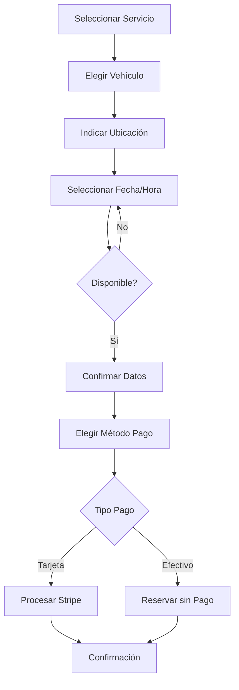

# 4.2.1 RF Cliente B2C

> Requisitos funcionales para el cliente consumidor final.

---

## Autenticación y Registro

| ID | Requisito | Prioridad |
|----|-----------|-----------|
| RF-B2C-001 | El usuario puede registrarse con Google OAuth | Alta |
| RF-B2C-002 | El usuario puede registrarse con email/password | Alta |
| RF-B2C-003 | El sistema valida email único | Alta |
| RF-B2C-004 | El usuario puede recuperar contraseña | Media |

## Gestión de Vehículos

| ID | Requisito | Prioridad |
|----|-----------|-----------|
| RF-B2C-010 | El usuario puede agregar vehículos | Alta |
| RF-B2C-011 | Cada vehículo tiene placa, marca, modelo, año | Alta |
| RF-B2C-012 | El usuario puede editar/eliminar vehículos | Media |

## Agendamiento

| ID | Requisito | Prioridad |
|----|-----------|-----------|
| RF-B2C-020 | El usuario puede ver catálogo de servicios | Alta |
| RF-B2C-021 | El usuario puede seleccionar fecha/hora | Alta |
| RF-B2C-022 | El usuario debe indicar ubicación GPS | Alta |
| RF-B2C-023 | El sistema valida disponibilidad | Alta |
| RF-B2C-024 | El usuario recibe confirmación | Alta |

## Pagos

| ID | Requisito | Prioridad |
|----|-----------|-----------|
| RF-B2C-030 | El usuario puede pagar con tarjeta (Stripe) | Alta |
| RF-B2C-031 | El usuario puede pagar en efectivo | Media |
| RF-B2C-032 | El sistema genera recibo digital | Alta |

## Referidos

| ID | Requisito | Prioridad |
|----|-----------|-----------|
| RF-B2C-040 | El usuario puede generar código de referido | Media |
| RF-B2C-041 | El referidor recibe crédito al usar código | Media |

---

## Historias de Usuario Detalladas

### HU-B2C-001: Agendamiento de Servicio

> **Como** cliente B2C  
> **Quiero** agendar un servicio de lavado para mi vehículo  
> **Para** mantener mi auto limpio sin perder tiempo

#### Criterios de Aceptación

- [ ] CA-01: El usuario ve catálogo con precios por tipo de vehículo
- [ ] CA-02: El calendario muestra solo horarios disponibles
- [ ] CA-03: El mapa permite ajustar ubicación con pin
- [ ] CA-04: El resumen muestra servicio + vehículo + precio + fecha
- [ ] CA-05: El usuario recibe email de confirmación
- [ ] CA-06: El usuario recibe push notification 1h antes

#### Flujo Principal

### HU-B2C-002: Gestión de Vehículos

> **Como** cliente B2C  
> **Quiero** registrar mis vehículos  
> **Para** agendar servicios rápidamente

#### Criterios de Aceptación

- [ ] CA-01: Formulario valida formato de placa mexicana
- [ ] CA-02: Selector de marca/modelo con catálogo actualizado
- [ ] CA-03: Año entre 1990 y actual+1
- [ ] CA-04: Foto opcional del vehículo
- [ ] CA-05: Máximo 5 vehículos por cuenta

---

## Excepciones y Errores

| Código | Escenario | Respuesta UI |
|--------|-----------|--------------|
| E-001 | Sin operadores disponibles | "No hay disponibilidad. ¿Deseas otra fecha?" |
| E-002 | Zona sin cobertura | "Aún no operamos ahí. ¡Pronto!" |
| E-003 | Pago rechazado | "No pudimos procesar. Intenta otro método." |

---

## Referencias

- [[Proyecto OnlyCarNLD/Datos/1.2.3 cliente_b2c_perfil|Perfil B2C]]
- [[Proyecto OnlyCarNLD/Datos/6.4.3 pantallas_b2c|Pantallas B2C]]

---

## Navegación

| ⬆️ Padre | [[Proyecto OnlyCarNLD/Datos/4.2 Requisitos_Funcionales]] |
|----------|--------------------------------|
| ➡️ Siguiente | [[Proyecto OnlyCarNLD/Datos/4.2.2 RF_Cliente_B2B]] |

---
