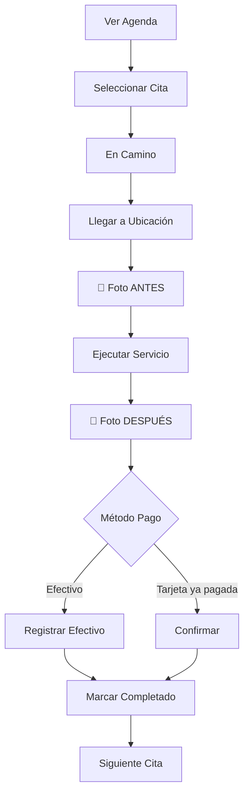

# 4.2.4 RF Operador

> Requisitos funcionales para operadores de lavado.

---

## Agenda

| ID | Requisito | Prioridad |
|----|-----------|-----------|
| RF-OP-001 | El operador ve agenda del día | Alta |
| RF-OP-002 | Cada cita muestra cliente, ubicación, servicio | Alta |
| RF-OP-003 | El operador puede navegar a ubicación | Alta |
| RF-OP-004 | El operador actualiza estado de cita | Alta |

## Control de Caja

| ID | Requisito | Prioridad |
|----|-----------|-----------|
| RF-OP-010 | El operador registra cobros en efectivo | Alta |
| RF-OP-011 | El operador registra cobros con tarjeta (Point) | Alta |
| RF-OP-012 | El sistema calcula corte diario | Alta |
| RF-OP-013 | El operador puede liquidar caja | Alta |

## Fotos del Servicio

| ID | Requisito | Prioridad |
|----|-----------|-----------|
| RF-OP-020 | El operador toma foto "antes" | Alta |
| RF-OP-021 | El operador toma foto "después" | Alta |
| RF-OP-022 | Las fotos se suben a R2 | Alta |
| RF-OP-023 | El cliente puede ver fotos | Media |

## Ganancias

| ID | Requisito | Prioridad |
|----|-----------|-----------|
| RF-OP-030 | El operador ve historial de ganancias | Alta |
| RF-OP-031 | El operador ve comisiones por servicio | Alta |
| RF-OP-032 | El operador ve proyección semanal | Media |

---

## Historias de Usuario Detalladas

### HU-OP-001: Ejecutar Servicio

> **Como** operador  
> **Quiero** gestionar mis citas del día  
> **Para** completar servicios eficientemente

#### Criterios de Aceptación

- [ ] CA-01: Ver agenda con citas ordenadas por hora
- [ ] CA-02: Navegar a ubicación con un tap
- [ ] CA-03: Cambiar estado: En camino → En progreso → Completado
- [ ] CA-04: Tomar fotos antes/después obligatorias
- [ ] CA-05: Registrar cobro al finalizar

#### Flujo del Servicio

### HU-OP-002: Control de Caja

> **Como** operador  
> **Quiero** ver mi corte del día  
> **Para** saber cuánto entregar al liquidar

#### Criterios de Aceptación

- [ ] CA-01: Total efectivo recaudado
- [ ] CA-02: Total tarjeta (no entrega)
- [ ] CA-03: Comisión a favor del operador
- [ ] CA-04: Monto a depositar a OnlyCar

---

## Referencias

- [[Proyecto OnlyCarNLD/Datos/1.2.2 operador_perfil|Perfil Operador]]
- [[Proyecto OnlyCarNLD/Datos/5.8. geolocalizacion|Geolocalización]]

## Navegación

| ⬆️ Padre | [[Proyecto OnlyCarNLD/Datos/4.2 Requisitos_Funcionales]] |
|----------|--------------------------------|
| ⬅️ Anterior | [[Proyecto OnlyCarNLD/Datos/4.2.3 RF_Corporate_Plus]] |
| ➡️ Siguiente | [[Proyecto OnlyCarNLD/Datos/4.2.5 RF_Admin]] |

---
