# 4.2.8 Diagrama Casos de Uso

> Diagrama UML de casos de uso principales por actor.

---

## Diagrama General

```mermaid
flowchart TB
    subgraph ACTORES["👥 Actores"]
        B2C[("👤 Cliente B2C")]
        B2B[("🏢 Cliente B2B")]
        CORP[("⭐ Corporate+")]
        OP[("🔧 Operador")]
        ADMIN[("👑 Admin")]
    end
    
    subgraph CORE["🎯 Casos de Uso Core"]
        UC1[Agendar Servicio]
        UC2[Pagar Servicio]
        UC3[Calificar Servicio]
        UC4[Ver Historial]
    end
    
    subgraph OPERADOR["🔧 Casos Operador"]
        UC10[Aceptar Cita]
        UC11[Registrar Cobro]
        UC12[Subir Fotos]
        UC13[Ver Ganancias]
    end
    
    subgraph ADMIN["👑 Casos Admin"]
        UC20[Gestionar Usuarios]
        UC21[Ver Dashboard]
        UC22[Configurar Sistema]
        UC23[Resolver Incidencias]
    end
    
    B2C --> UC1
    B2C --> UC2
    B2C --> UC3
    B2C --> UC4
    
    B2B --> UC1
    B2B --> UC4
    CORP -.-> UC1
    
    OP --> UC10
    OP --> UC11
    OP --> UC12
    OP --> UC13
    
    ADMIN --> UC20
    ADMIN --> UC21
    ADMIN --> UC22
    ADMIN --> UC23
```

---

## Casos de Uso por Actor

### Cliente B2C

| ID        | Caso de Uso      | Descripción                     |
| --------- | ---------------- | ------------------------------- |
| UC-B2C-01 | Registrarse      | Crear cuenta vía OAuth/email    |
| UC-B2C-02 | Agregar vehículo | Registrar datos del vehículo    |
| UC-B2C-03 | Agendar servicio | Solicitar lavado/detailing      |
| UC-B2C-04 | Pagar            | Completar pago tarjeta/efectivo |
| UC-B2C-05 | Calificar        | Evaluar servicio recibido       |
| UC-B2C-06 | Ver historial    | Consultar servicios pasados     |

### Operador

| ID | Caso de Uso | Descripción |
|----|-------------|-------------|
| UC-OP-01 | Ver agenda | Consultar citas asignadas |
| UC-OP-02 | Aceptar/Rechazar | Responder a solicitudes |
| UC-OP-03 | Ejecutar servicio | Realizar el trabajo |
| UC-OP-04 | Documentar | Subir fotos antes/después |
| UC-OP-05 | Cobrar | Registrar pago recibido |
| UC-OP-06 | Ver ganancias | Consultar balance |

---

## Referencias

- [[Proyecto OnlyCarNLD/Datos/1.2.2 operador_perfil|Perfil Operador]]
- [[Proyecto OnlyCarNLD/Datos/1.2.3 cliente_b2c_perfil|Perfil B2C]]
- [[Proyecto OnlyCarNLD/Datos/4.2.1 RF_Cliente_B2C|RFs B2C]]

---

## Navegación

| ⬆️ Padre | [[Proyecto OnlyCarNLD/Datos/4.2 Requisitos_Funcionales]] |
|----------|--------------------------------|
| ⬅️ Anterior | [[Proyecto OnlyCarNLD/Datos/4.2.7 Matriz_Priorizacion_RF]] |

---
