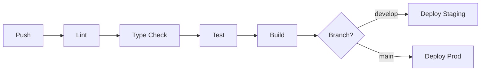

# 4.8.4 CI/CD Pipeline

> GitHub Actions + Cloudflare Pages.

---

## Flujo

---

## Jobs

| Job | Trigger | Duración |
|-----|---------|----------|
| lint | PR, push | ~30s |
| typecheck | PR, push | ~45s |
| test | PR, push | ~2m |
| build | merge | ~3m |
| deploy | merge | ~1m |

---

## Secrets

| Secret | Uso |
|--------|-----|
| `CLOUDFLARE_API_TOKEN` | Deploy |
| `SUPABASE_URL` | Build |
| `SUPABASE_ANON_KEY` | Build |

---

## Navegación

| ⬆️ Padre | [[Proyecto OnlyCarNLD/Datos/4.8 Ambientes_Despliegue]] |
|----------|------------------------------|
| ⬅️ Anterior | [[Proyecto OnlyCarNLD/Datos/4.8.3 Ambiente_Production]] |
| ➡️ Siguiente | [[Proyecto OnlyCarNLD/Datos/4.8.5 Feature_Flags]] |

---
