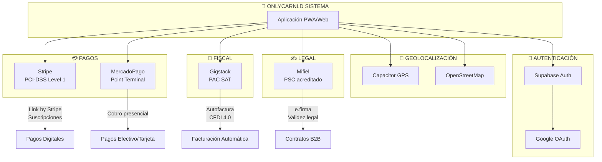

# 5.0 Integraciones Externas

> Sistema de integraciones que delega completamente el procesamiento de datos fiscales y firma digital a proveedores certificados, minimizando la responsabilidad legal y técnica de OnlyCar.

---

## Principio de Delegación Total

OnlyCar **NO procesa**:
- ❌ Datos fiscales de clientes (RFC, Razón Social, Régimen)
- ❌ Certificados digitales (e.firma/FIEL)
- ❌ Timbrado de CFDIs
- ❌ Aplicación de firmas criptográficas

**Todo es delegado a proveedores certificados:**

| Proveedor    | Función                                   | Certificación          |
| ------------ | ----------------------------------------- | ---------------------- |
| **Stripe**   | Pasarela de pagos + captura datos fiscales | PCI-DSS Level 1        |
| **Gigstack** | Facturación automática CFDI 4.0           | PAC autorizado por SAT |
| **Mifiel**   | Firma digital de contratos B2B            | PSC acreditado por SE  |

---

## Arquitectura de Integraciones

---

## Estructura de Hijos

| ID                                      | Nombre             | Descripción               | Nietos | Estado |
| --------------------------------------- | ------------------ | ------------------------- | ------ | ------ |
| [[Proyecto OnlyCarNLD/Datos/5.1. stripe_pagos\|5.1]]              | Stripe Pagos       | Pasarela de pagos         | 0 | ✅      |
| [[Proyecto OnlyCarNLD/Datos/5.2. gigstack_facturacion\|5.2]]      | Gigstack           | Facturación automática    | 0      | ✅      |
| [[Proyecto OnlyCarNLD/Datos/5.3. mifiel_firmas\|5.3]]             | Mifiel             | Firma digital             | 0      | ✅      |
| [[Proyecto OnlyCarNLD/Datos/5.4. cumplimiento_legal_fiscal\|5.4]] | Cumplimiento Legal | LFPDPPP, CFF              | 0      | ✅      |
| [[Proyecto OnlyCarNLD/Datos/5.5. webhooks_integracion\|5.5]]      | Webhooks           | Webhooks de integraciones | 0      | ✅      |
| [[Proyecto OnlyCarNLD/Datos/5.6. autenticacion\|5.6]]             | Autenticación      | OAuth + Email/Password    | 0 | ✅      |
| [[Proyecto OnlyCarNLD/Datos/5.7. pdfme_generacion\|5.7]]          | PDFme              | Generación de PDFs        | 0      | ✅      |
| [[Proyecto OnlyCarNLD/Datos/5.8. geolocalizacion\|5.8]]           | Geolocalización    | GPS, mapas, tracking      | 0 | ✅      |
| [[Proyecto OnlyCarNLD/Datos/5.9 soporte_externo\|5.9]]            | Soporte Externo    | Tawk.to + Chatwoot        | 0 | ✅      |
| [[Proyecto OnlyCarNLD/Datos/5.11 mercadopago_integracion\|5.11]]  | MercadoPago        | Point Terminal + Checkout | 0 | ✅      |

---

## Ventajas del Modelo Delegado

**Reducción de complejidad:**

- ❌ **95% menos código** de facturación
- ❌ **90% menos responsabilidad legal**
- ❌ **Cero gestión de CSD** para timbrado
- ❌ **Cero gestión de certificados digitales**
- ❌ **Cero almacenamiento de datos fiscales** sensibles
- ❌ **Cero procesamiento de e.firma/FIEL**
- ❌ **Cero almacenamiento de credenciales** (OAuth delegado)

**Beneficios operativos:**

- ✅ **Facturación 100% automática**
- ✅ **Firma de contratos 100% delegada**
- ✅ **Validación SAT en tiempo real**
- ✅ **Cumplimiento automático** con cambios normativos
- ✅ **Factura global mensual** automática
- ✅ **Firmas con validez legal plena**
- ✅ **Autenticación dual** (OAuth + Email/Password blindado)
- ✅ **Generación PDF dinámica** (PDFme)

---

## Costo-Beneficio

| Métrica                             | Desarrollo Propio      | Modelo Delegado           |
| ----------------------------------- | ---------------------- | ------------------------- |
| Costo inicial                       | $150,000-250,000 MXN   | ~$0 MXN                   |
| Mantenimiento mensual               | $10,000-20,000 MXN     | ~$0 MXN                   |
| Por servicio B2C $1000              | N/A                    | ~$42-44 MXN (4.2-4.4%)    |
| Por servicio B2B $1000 + contrato   | N/A                    | ~$75-90 MXN (7.5-9%)      |
| ROI                                 | Negativo 1-2 años      | Positivo desde mes 1      |

---

## Navegación

| ⬆️ Padre             | [[Proyecto OnlyCarNLD/Datos/0. Contexualizador]]              |
| -------------------- | ----------------------------------- |
| ⬅️ Hermano anterior  | [[Proyecto OnlyCarNLD/Datos/4.0. necesidades_del_sistema]]    |
| ➡️ Hermano siguiente | [[Proyecto OnlyCarNLD/Datos/6.0. UI-UX]]                      |

---

**Versión:** 5.2 (+ Auth + PDFme)  
**Cumplimiento:** México - LFPDPPP 2025 / CFF / CFDI 4.0 / Ley de Firma Electrónica Avanzada
