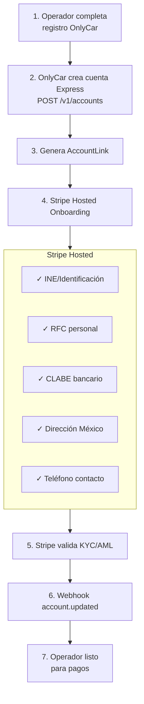

# 5.1.1 Stripe Connect Express

Integración con Stripe Connect para payouts automáticos a operadores.

---

## ¿Por qué Stripe Connect Express?

| Requisito OnlyCar | Stripe Connect | Estado |
|-------------------|----------------|--------|
| Verificar identidad operador | KYC automático | ✅ |
| NO almacenar datos bancarios | Stripe almacena | ✅ |
| Pagos semanales automáticos | Configurable | ✅ |
| Disponible México | Express accounts | ✅ |
| Cumplimiento fiscal | SAT/RFC validado | ✅ |

---

## Flujo de Onboarding

```
1. Operador completa registro OnlyCar
        │
        ▼
2. OnlyCar crea cuenta Express
   POST /v1/accounts
   { type: 'express', country: 'MX' }
        │
        ▼
3. Genera AccountLink (URL Stripe)
        │
        ▼
4. Redirige a Stripe Hosted Onboarding
   ┌────────────────────────────────────────┐
   │  [STRIPE HOSTED]                       │
   │                                        │
   │  ✓ INE/Identificación                  │
   │  ✓ RFC personal (13 chars)             │
   │  ✓ CLABE bancario (18 dígitos)         │
   │  ✓ Dirección México                    │
   │  ✓ Teléfono de contacto                │
   └────────────────────────────────────────┘
        │
        ▼
5. Stripe valida KYC/AML automáticamente
        │
        ▼
6. Webhook account.updated → OnlyCar
        │
        ▼
7. Operador listo para recibir pagos
```



---

## Implementación

### 1. Crear Cuenta Express

```typescript
// server/api/operador/stripe-connect.post.ts
import Stripe from 'stripe';

const stripe = new Stripe(process.env.STRIPE_SECRET_KEY!);

export default defineEventHandler(async (event) => {
  const { operadorId, email, nombre } = await readBody(event);
  
  // Crear cuenta Express
  const account = await stripe.accounts.create({
    type: 'express',
    country: 'MX',
    email,
    capabilities: {
      transfers: { requested: true }
    },
    business_profile: {
      mcc: '7542', // Car wash
      name: nombre
    },
    settings: {
      payouts: {
        schedule: {
          interval: 'weekly',
          weekly_anchor: 'saturday'
        }
      }
    }
  });
  
  // Guardar ID en Supabase
  await supabase.from('operadores').update({
    stripe_connect_id: account.id,
    stripe_status: 'pending'
  }).eq('id', operadorId);
  
  return { accountId: account.id };
});
```

### 2. Generar Link de Onboarding

```typescript
// server/api/operador/stripe-link.post.ts
export default defineEventHandler(async (event) => {
  const { accountId, operadorId } = await readBody(event);
  
  const accountLink = await stripe.accountLinks.create({
    account: accountId,
    refresh_url: `${process.env.APP_URL}/operador/stripe/refresh`,
    return_url: `${process.env.APP_URL}/operador/stripe/complete`,
    type: 'account_onboarding'
  });
  
  return { url: accountLink.url };
});
```

### 3. Webhook de Verificación

```typescript
// server/api/webhooks/stripe-connect.post.ts
export default defineEventHandler(async (event) => {
  const sig = getHeader(event, 'stripe-signature');
  const body = await readRawBody(event);
  
  const stripeEvent = stripe.webhooks.constructEvent(
    body,
    sig,
    process.env.STRIPE_CONNECT_WEBHOOK_SECRET!
  );
  
  if (stripeEvent.type === 'account.updated') {
    const account = stripeEvent.data.object;
    
    if (account.details_submitted && account.charges_enabled) {
      // Operador verificado
      await supabase.from('operadores').update({
        stripe_status: 'verified',
        verificado_stripe_at: new Date()
      }).eq('stripe_connect_id', account.id);
    }
  }
  
  return { received: true };
});
```

### 4. Payout Semanal

```typescript
// Cron: Viernes 23:59
const procesarPayoutsSemanal = async () => {
  const { data: operadores } = await supabase
    .from('operadores')
    .select('id, stripe_connect_id')
    .eq('stripe_status', 'verified');
  
  for (const op of operadores) {
    const { data: pago } = await supabase
      .from('pagos_operador')
      .select('monto_neto')
      .eq('operador_id', op.id)
      .eq('estado', 'pendiente')
      .single();
    
    if (pago && pago.monto_neto > 0) {
      // Crear transferencia a cuenta Connect
      await stripe.transfers.create({
        amount: Math.round(pago.monto_neto * 100), // centavos
        currency: 'mxn',
        destination: op.stripe_connect_id,
        description: `Pago semanal ${format(new Date(), 'yyyy-MM-dd')}`
      });
    }
  }
};
```

---

## Costos Stripe Connect México

| Concepto | Valor |
|----------|-------|
| Usuario activo/mes | MXN $35 |
| Volumen payout | 0.25% |
| Por payout | MXN $12 |

**Ejemplo: Operador $10,000/semana**
- Fijo: $35/4 = $8.75/semana
- Volumen: $10,000 × 0.25% = $25
- Payout: $12
- **Total: ~$46/semana** (0.46%)

---

## Datos que OnlyCar NO Almacena

| Dato | Almacena OnlyCar | Almacena Stripe |
|------|------------------|-----------------|
| CLABE | ❌ | ✅ |
| RFC | ❌ | ✅ |
| INE | ❌ | ✅ |
| Dirección | ❌ | ✅ |
| `stripe_connect_id` | ✅ | — |

---

## Modelo de Datos OnlyCar

```sql
-- Solo almacenamos referencia
ALTER TABLE operadores ADD COLUMN stripe_connect_id VARCHAR(50);
ALTER TABLE operadores ADD COLUMN stripe_status VARCHAR(20) DEFAULT 'none';
-- none, pending, verified, restricted

CREATE INDEX idx_operadores_stripe ON operadores(stripe_connect_id);
```

---

→ Ver pagos a cliente: [[Proyecto OnlyCarNLD/Datos/5.1. stripe_pagos]]

---

## Navegación

| ⬆️ Padre            | [[Proyecto OnlyCarNLD/Datos/5.1. stripe_pagos]]  |
| ------------------- | ---------------------- |

---
