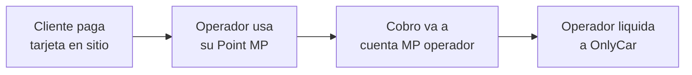

# 5.11 MercadoPago — Integración

> Sistema de pagos físicos y liquidación de caja.

---

## Rol en OnlyCar

> [!IMPORTANT]
> **MercadoPago** = Pagos FÍSICOS (efectivo, tarjeta presencial)
> **Stripe** = Pagos DIGITALES (online, automáticos)

| Proveedor       | Uso Principal                              |
| --------------- | ------------------------------------------ |
| **Stripe**      | Cobros online a clientes, payouts a operadores |
| **MercadoPago** | Terminal física, liquidación caja operador |

---

## Casos de Uso

### 1. Terminal Física del Operador

### 2. Liquidación de Caja

| Tipo | Descripción |
|------|-------------|
| **Efectivo** | Operador recibe efectivo → Fondea su MP → Paga vía Checkout |
| **Tarjeta MP** | Operador cobra con Point → Paga a OnlyCar vía Checkout |

---

## Estructura de Hijos

| ID                                      | Nombre               | Descripción       | Estado |
| --------------------------------------- | -------------------- | ----------------- | ------ |
| [[Proyecto OnlyCarNLD/Datos/5.11.1 point_terminal\|5.11.1]]       | Point Terminal       | Terminal física   | ✅      |
| [[Proyecto OnlyCarNLD/Datos/5.11.2 checkout_liquidacion\|5.11.2]] | Checkout Liquidación | Proceso de cobro  | ✅      |
| [[Proyecto OnlyCarNLD/Datos/5.11.3 webhooks_mercadopago\|5.11.3]] | Webhooks             | Notificaciones MP | ✅      |
| [[Proyecto OnlyCarNLD/Datos/5.11.4 flujo_operador\|5.11.4]]       | Flujo Operador       | Flujo completo    | ✅      |

---

## Navegación

| ⬆️ Padre             | [[Proyecto OnlyCarNLD/Datos/5.0. integraciones]]           |
| -------------------- | -------------------------------- |
| ⬅️ Hermano anterior  | [[Proyecto OnlyCarNLD/Datos/5.8. geolocalizacion]]         |
| 🔗 Ver también       | [[Proyecto OnlyCarNLD/Datos/3.1.9 control_caja]]           |

---
